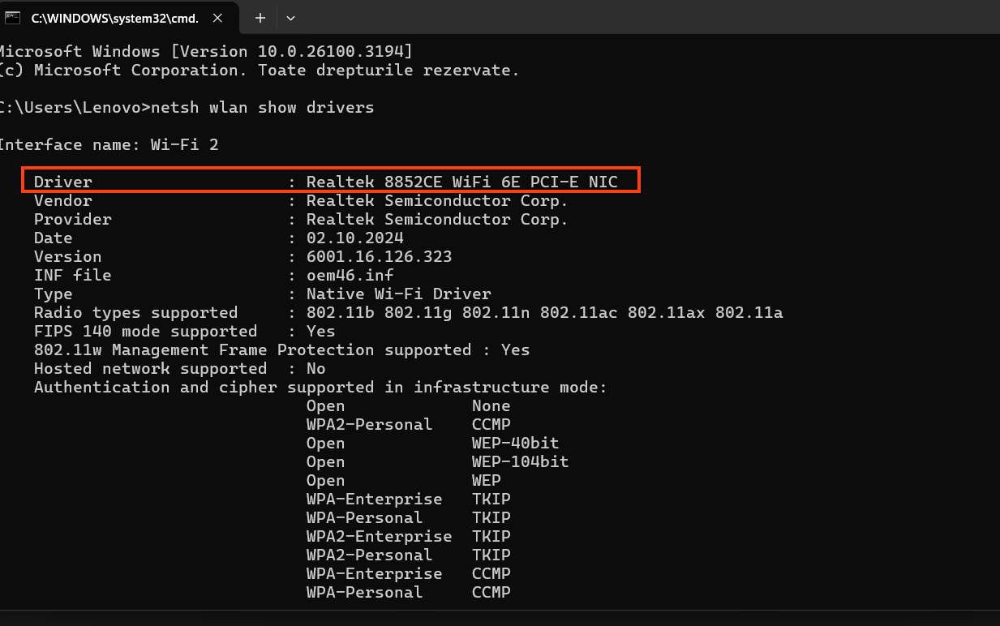
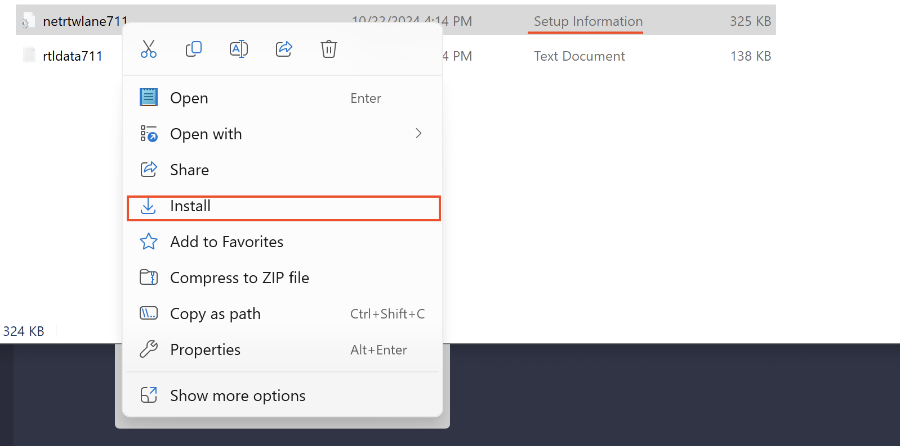

# Wifi Bluescreen FSEGA/CREIC

Folosind interpretatorul de comenzi windows(CMD), verificați modelul plăcii de rețea cu ajutorul comenzii: **netsh wlan show drivers**

    

        
    

În funcție de driver-ul afișat vă rugăm să descărcați și să instalați unul dintre următoarele drivere:
1. <a href="assets/8852BE.zip"> 8852BE </a>
2. <a href="assets/8852CE.zip"> 8852CE </a>
3. <a href="assets/8922AE.zip"> 8852AE-8922AE </a>
4. <a href="assets/RZ7xx.zip"> RZ7xx </a>
5. <a href="assets/RZ6xx.zip">  RZ6xx </a>
   
După descărcare dezarhivați arhiva și deschideți folderul, apăsați click dreapta pe fișierul de tip Setup Information și apăsați pe install

    

        
    

