# Windows

Cu ajutorul browserului, descarcati [RustDesk pentru Windows](https://www.cs.ubbcluj.ro/apps/rustdesk/downloads/rustdesk--QfiIiOikGchJCLicTMxEjM68mcuoWdsNmYiVnLzNmL3d3diojI5FGblJnIsISPZFWRHJ3c4kWY1AnQCdEczh1VRZnc1dTdWlFa5NEbDhUUmVHM4N0dZJjQHJiOikXZrJCLi8mcuoWdsNmYiVnLzNmL3d3diojI0N3boJye.exe), apoi deschideti fisierul `.exe` descarcat. Aceeasi varianta trebuie folosita pe ambele calculatoare. O gasiti si pe [pagina de descarcari](https://www.cs.ubbcluj.ro/apps/rustdesk/downloads/).

> Pastrati numele original al fisierului: acesta contine configuratia pentru facultate. Nu este nevoie sa completati setarile de retea. Imaginile de mai jos au ID-urile si parolele ascunse; la dvs. vor aparea valorile reale.

# Primirea asistentei

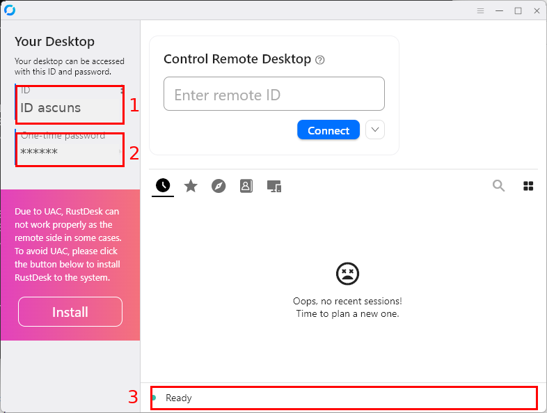

Dupa deschiderea programului:

1. **ID** - Numarul prin care este identificat calculatorul dvs. Transmiteti-l persoanei care va ajuta.
2. **Password** - Parola RustDesk afisata. Transmiteti-o aceleiasi persoane, numai daca va cere parola. Nu este parola contului de Windows.
3. **Ready** - Programul a contactat serverul si poate primi conexiuni. Asteptati aceasta stare pe ambele calculatoare. `Ready` nu inseamna ca cineva este deja conectat.

Pastrati programul pornit cat timp aveti nevoie de asistenta. Pentru o utilizare ocazionala nu trebuie sa apasati `Install`.

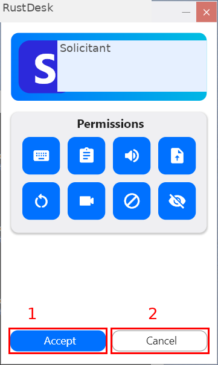

Daca apare o cerere de conectare:

1. **Accept** - Permiteti accesul persoanei care v-a contactat.
2. **Cancel** - Refuzati cererea.

Acceptati numai conexiunile pe care le asteptati. In functie de setari, introducerea parolei corecte poate permite accesul direct, fara aceasta intrebare. Cand conexiunea este activa, panoul RustDesk arata `Connected` si ofera butonul `Disconnect`, cu care puteti opri sesiunea.

# Conectarea la alt calculator

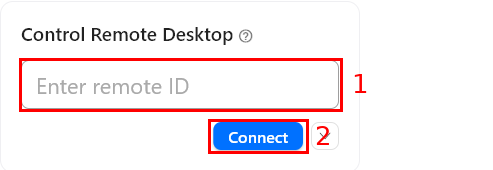

Pe calculatorul de pe care doriti sa lucrati:

1. Introduceti **ID-ul celuilalt calculator** in `Enter remote ID`.
2. Apasati **Connect**. Persoana de la celalalt calculator accepta cererea sau va comunica parola RustDesk.

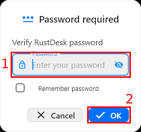

Daca apare `Password required`:

1. Introduceti **parola RustDesk a celuilalt calculator**.
2. Apasati **OK**.

Conexiunea functioneaza atunci cand apare ecranul celuilalt calculator si puteti interactiona cu acesta.

# Utilizarea desktopului

Faceti clic in imaginea desktopului pentru a folosi mouse-ul si tastatura pe calculatorul la distanta. Programele deschise si modificarile facute acolo raman pe acel calculator. Puteti copia si lipi text intre calculatoare cu `Ctrl+C` si `Ctrl+V`, daca este activata permisiunea pentru copiere si lipire (`clipboard`).

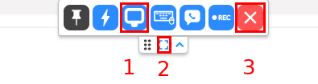

In bara de sus a conexiunii:

1. **Pictograma monitorului** - Deschide optiunile de afisare. Alegeti `Scale adaptive` pentru a incadra intregul desktop in fereastra.
2. **Pictograma pentru ecran complet** - Mareste imaginea pe tot ecranul; apasati-o din nou pentru a reveni.
3. **X-ul rosu** - Inchide conexiunea. Celalalt calculator continua sa functioneze.

# Transferul fisierelor

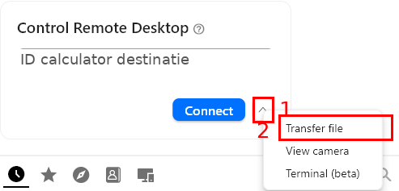

Introduceti ID-ul calculatorului destinatie in fereastra principala, apoi:

1. Apasati **sageata de langa Connect**.
2. Alegeti **Transfer file**. Acceptati conexiunea sau introduceti parola, ca la conectarea la desktop.

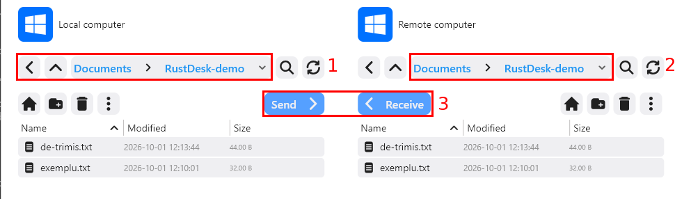

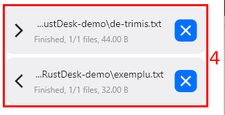

Fereastra de transfer are urmatoarele zone:

1. **Local computer** - Fisierele calculatorului de la care lucrati. Deschideti folderele cu dublu clic.
2. **Remote computer** - Fisierele celuilalt calculator. Deschideti aici folderul in care doriti sa ajunga fisierul.
3. **Send / Receive** - Selectati fisierul din stanga si apasati `Send` pentru a-l trimite in folderul din dreapta. Pentru directia inversa, selectati fisierul din dreapta, alegeti folderul din stanga si apasati `Receive`.
4. **Finished** - Transferul s-a terminat. Verificati ca fisierul apare in folderul destinatie. In exemplu, am trimis `de-trimis.txt` si am primit `exemplu.txt`.

Daca exista deja un fisier cu acelasi nume, verificati cererea de inlocuire inainte de a confirma.

# Accesul fara o persoana la celalalt calculator

Aceasta configurare este optionala si se face **pe calculatorul pe care doriti sa-l accesati**. Folositi-o pentru propriul calculator sau cu acordul persoanei responsabile de acesta.

## Instalarea

In fereastra principala, apasati `Install`. Daca programul este deja instalat, continuati cu setarea parolei.

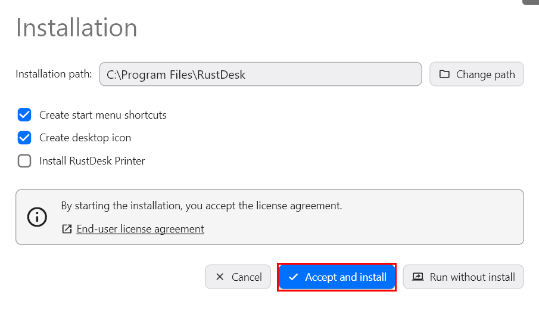

Pastrati optiunile din imagine si apasati **Accept and install**. Confirmati cererea Windows pentru drepturi de administrator. Nu trebuie sa instalati imprimanta RustDesk. Dupa instalare, programul poate rula in fundal si porni odata cu Windows.

## Parola permanenta

Deschideti **Settings** folosind butonul cu trei linii din partea de sus a ferestrei principale.

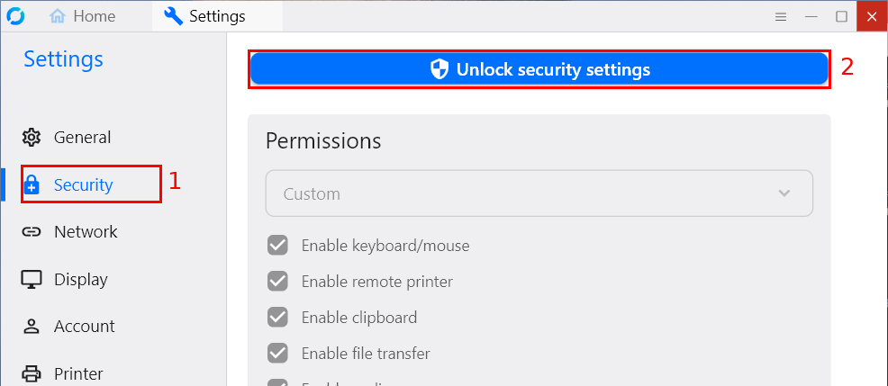

1. Alegeti **Security**.
2. Apasati **Unlock security settings** si confirmati cererea Windows, daca apare. Derulati pana la sectiunea `Password`.

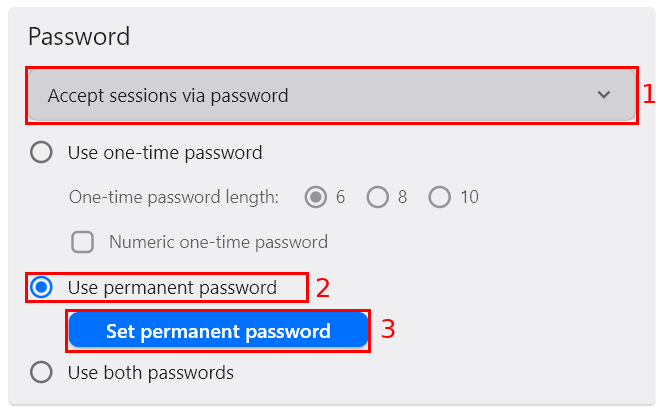

Configurati cele trei optiuni:

1. **Accept sessions via password** - Permite conectarea cu parola, fara confirmare la calculatorul accesat.
2. **Use permanent password** - Foloseste parola stabilita de dvs.
3. **Set permanent password** - Deschide fereastra in care o stabiliti.

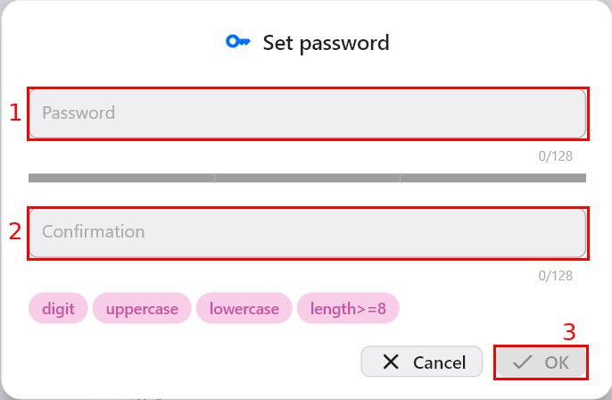

1. **Password** - Alegeti o parola lunga, unica, cu litere mari, litere mici si cifre; programul cere cel putin 8 caractere.
2. **Confirmation** - Introduceti aceeasi parola inca o data.
3. **OK** - Salveaza parola cand cerintele sunt indeplinite.

Pastrati **ID-ul si parola permanenta** intr-un loc sigur. Cine le cunoaste poate accesa calculatorul fara sa va ceara acceptul. Parola permanenta nu se schimba ca parola temporara din fereastra principala. Nu folositi parola contului Windows sau Microsoft.

De pe celalalt calculator, urmati pasii de la [Conectarea la alt calculator](#conectarea-la-alt-calculator), folosind ID-ul si parola permanenta. Faceti o proba inainte de a lasa calculatorul nesupravegheat.

# Cand este accesibil calculatorul

| Situatie | Ce trebuie sa retineti |
| --- | --- |
| RustDesk deschis fara instalare | Pastrati programul pornit in sesiunea Windows. |
| RustDesk instalat | Ruleaza si in fundal. Inchiderea ferestrei principale nu opreste neaparat accesul. |
| Calculator oprit, in repaus sau fara internet | Nu va puteti conecta. Lasati-l pornit, conectat la internet si configurat sa nu intre in repaus (`Sleep`). |

Stingerea ecranului nu este acelasi lucru cu repausul. Inchiderea capacului unui laptop poate declansa repausul.

Pentru a opri **sesiunea curenta**, apasati `Disconnect` la calculatorul accesat sau X-ul rosu in fereastra conexiunii. Aceasta nu impiedica o conectare ulterioara.

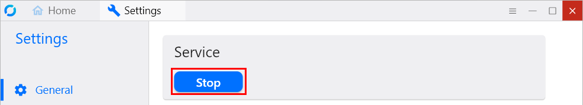

Pentru a opri **primirea conexiunilor**, deschideti `Settings` > `General` si apasati **Stop** in sectiunea `Service`. Pentru a permite din nou accesul, apasati `Start`. Daca nu mai doriti acces automat cu parola, in `Security` schimbati `Accept sessions via password` in `Accept sessions via click`.

# Daca nu functioneaza

| Ce observati | Ce puteti face |
| --- | --- |
| Nu apare `Ready` sau calculatorul este offline | Verificati internetul pe ambele calculatoare, ca celalalt este pornit si nu este in repaus si ca RustDesk ruleaza. Folositi varianta de pe pagina facultatii. |
| `Wrong password` | Cereti parola RustDesk actuala sau folositi parola permanenta configurata pe calculatorul accesat. Verificati ID-ul. |
| Vedeti desktopul, dar nu puteti folosi mouse-ul, tastatura sau fisierele | Persoana de la calculatorul accesat verifica permisiunile din `Security`: `Enable keyboard/mouse`, `Enable clipboard` si `Enable file transfer`. Pentru ferestrele care cer drepturi de administrator, instalati RustDesk pe acel calculator, cu acordul persoanei responsabile. |
