# Videoproiectoare Epson pe macOS

> Urmariti acest ghid pentru a va conecta wireless la videoproiectoarele Epson de pe un calculator cu MacOS

## 1. Instalare


### - Descarcare
Accesati urmatorul link pentru a descarca aplicatia iProjection: [link descarcare](https://epson.com/support/wireless-projector-support)

Va trebui sa derulati pagina pana la urmatorul buton:
<p>
  <center>
    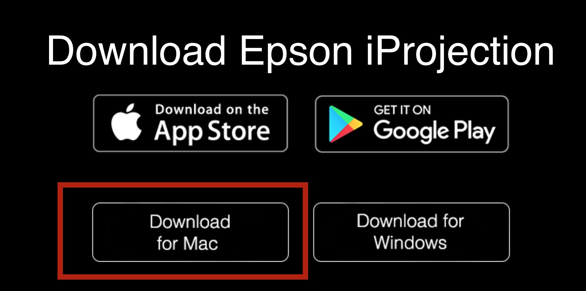
  </center>
</p>

### - Pasii de instalare
Veti naviga in Finder catre fisierul descarcat (de forma iProj_X.YZ.dmg, unde XYZ reprezinta versiunea programului) si veti da click dreapta, open.
<p>
  <center>
    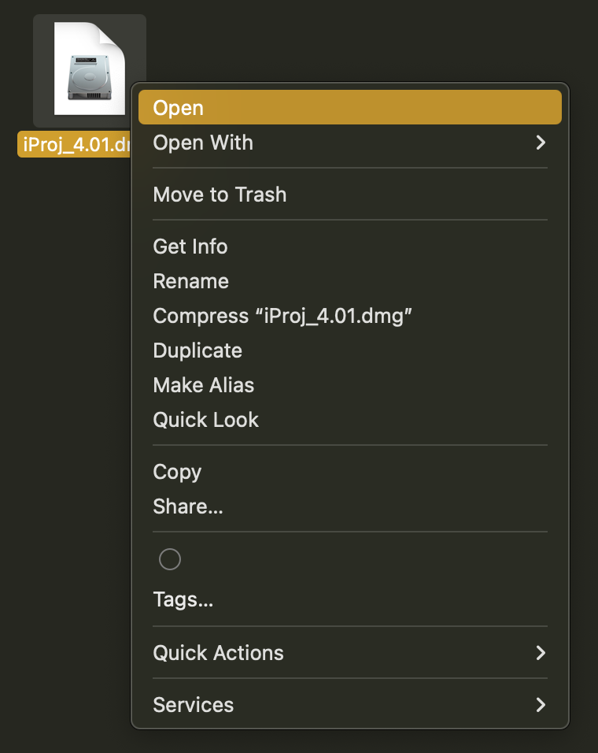
  </center>
</p>

Urmatoarea fereastra va aparea. Va trebui sa dati din nou click dreapta si open pe fisierul iProjectionInstaller.pkg
<p>
  <center>
    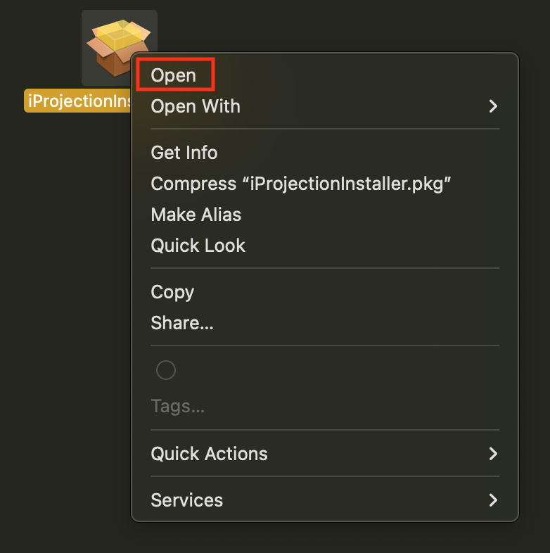
  </center>
</p>

In cazul in care urmatoarea fereastra va aparea, apasati pe butonul de ```Allow```:
<p>
  <center>
    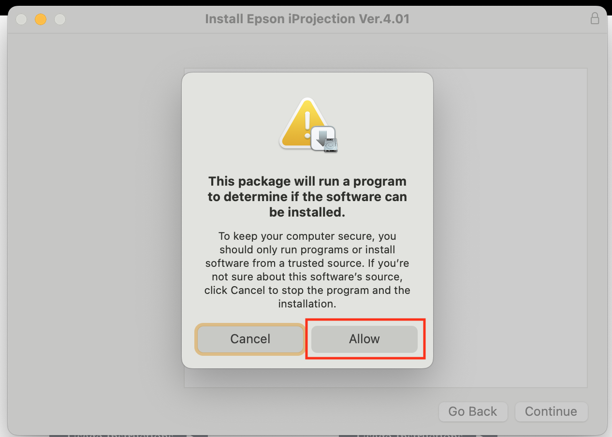
  </center>
</p>

Apasati pe ```Continue```
<p>
  <center>
    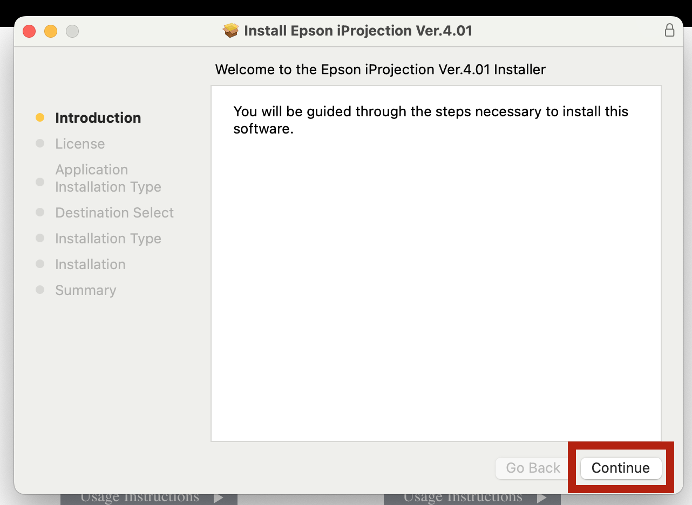
  </center>
</p>

Apasati pe ```Continue``` din nou
<p>
  <center>
    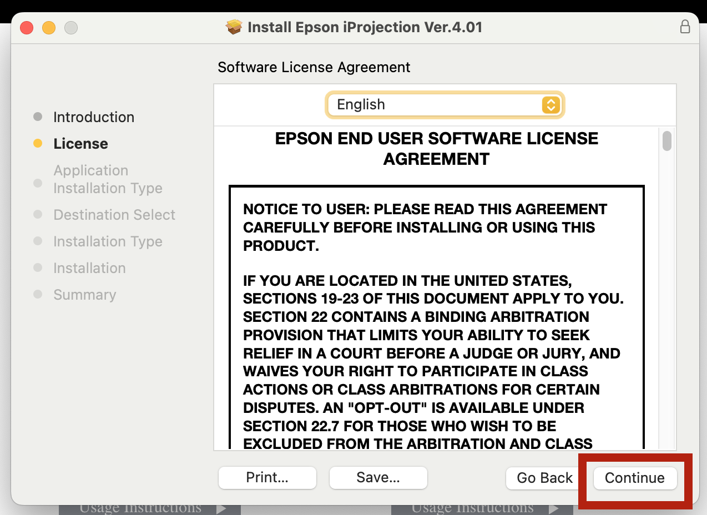
  </center>
</p>

Din nou, ```Continue```
<p>
  <center>
    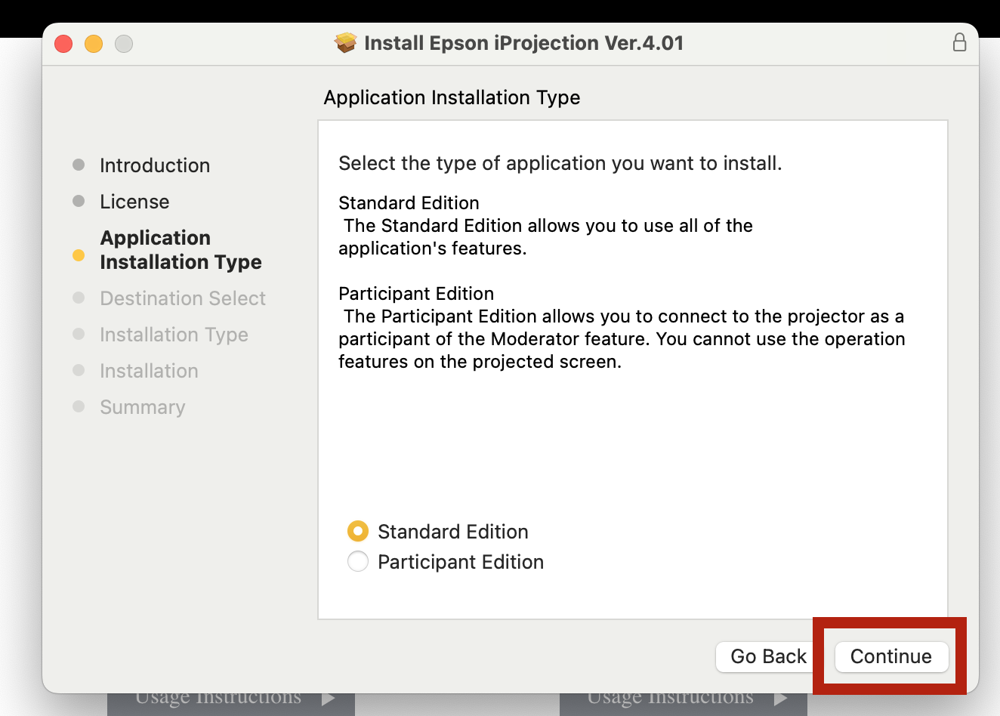
  </center>
</p>

```Continue```
<p>
  <center>
    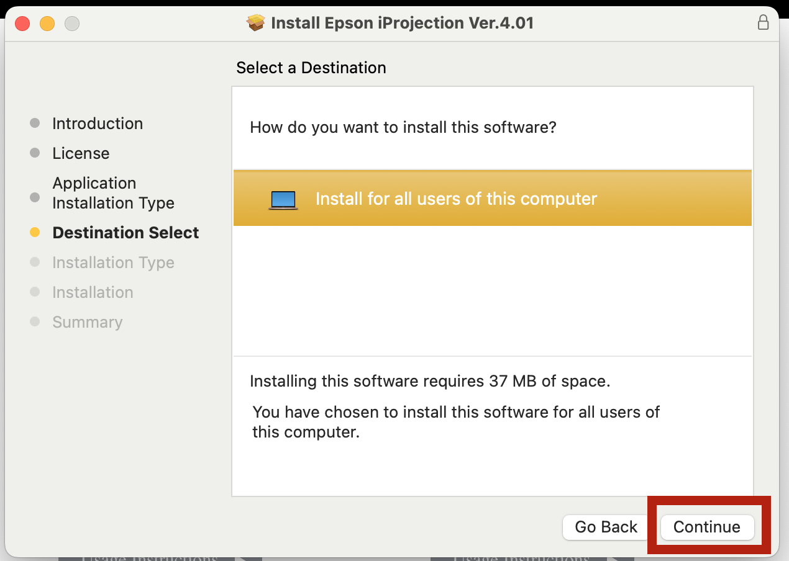
  </center>
</p>

Iar acum, ```Install```
<p>
  <center>
    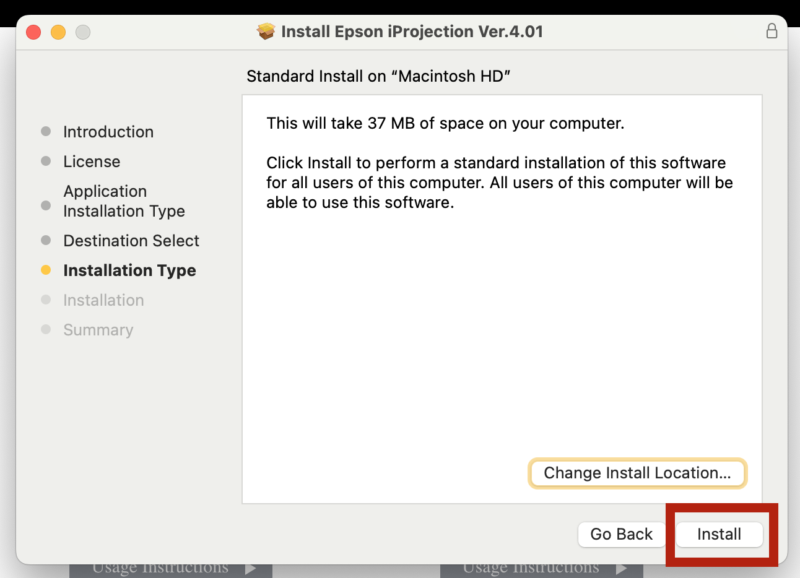
  </center>
</p>

In functie de caz, installer-ul va cere amprenta sau parola laptopului:
<p>
  <center>
    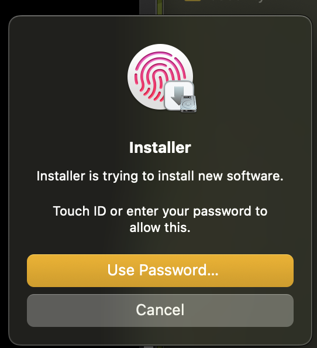
  </center>
</p>

Super! Aplicatia s-a instalat si putem inchide apasand pe butonul ```Close```:
<p>
  <center>
    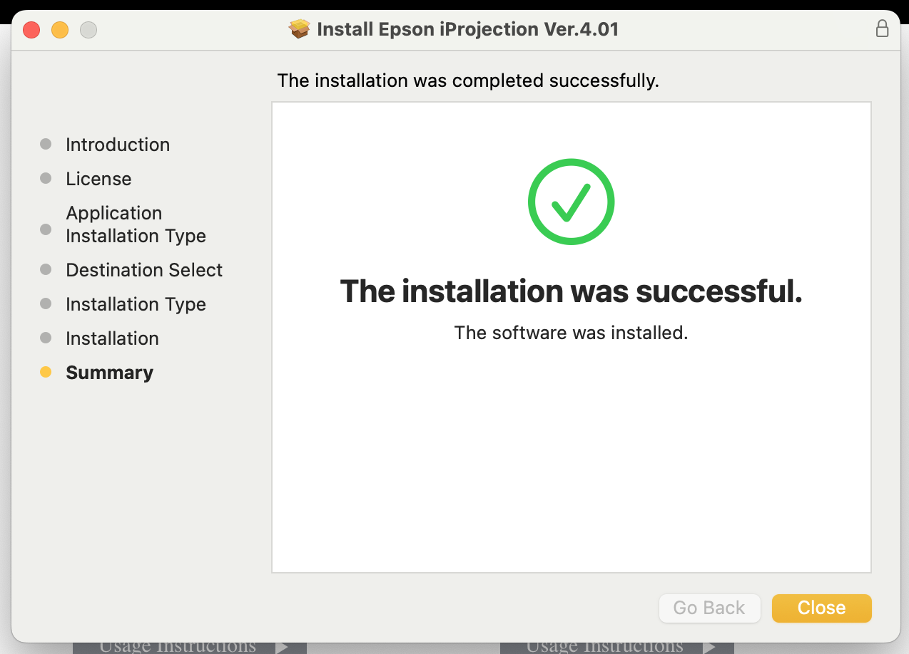
  </center>
</p>

Deschidem aplicatia din ```Applications``` (din dock / Finder / Spotlight):
<p>
  <center>
    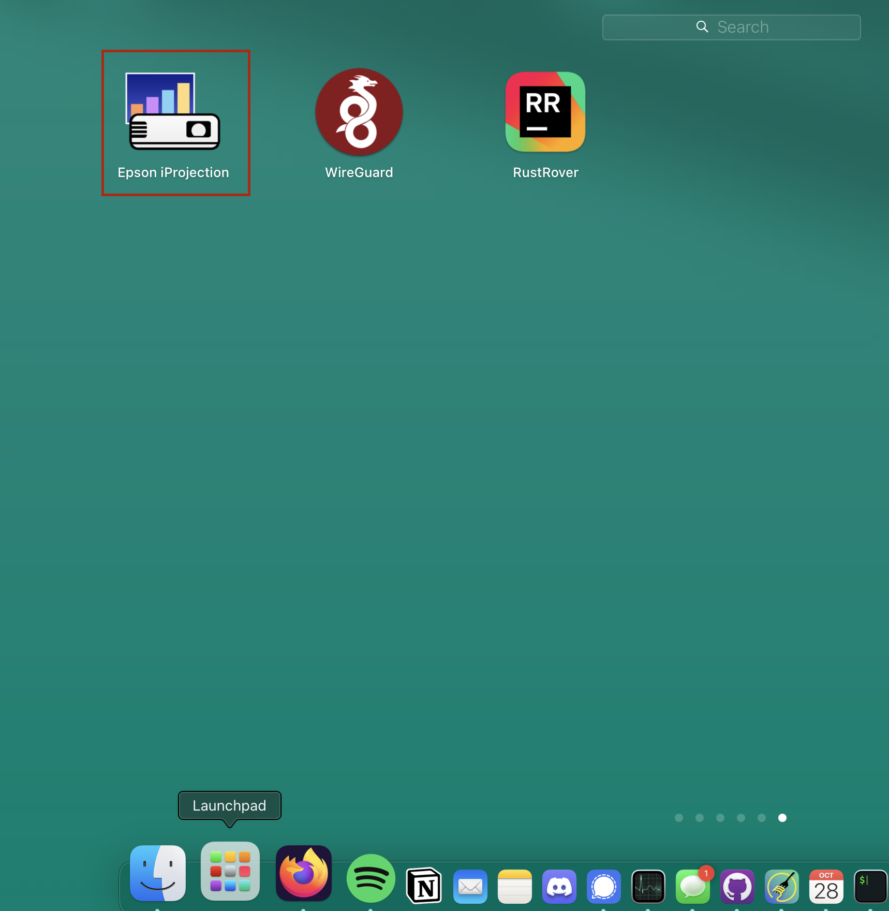
  </center>
</p>

<p>
  <center>
    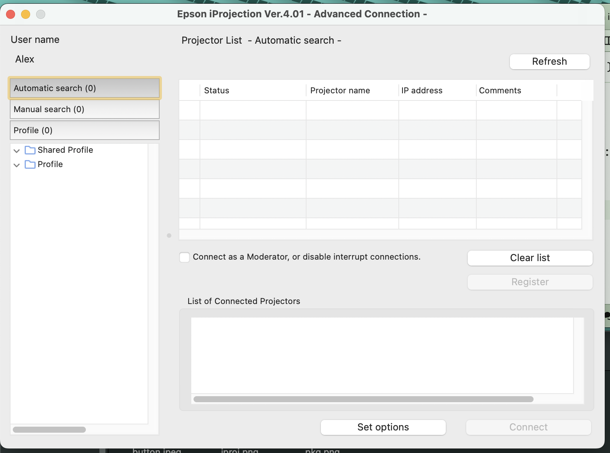
  </center>
</p>
