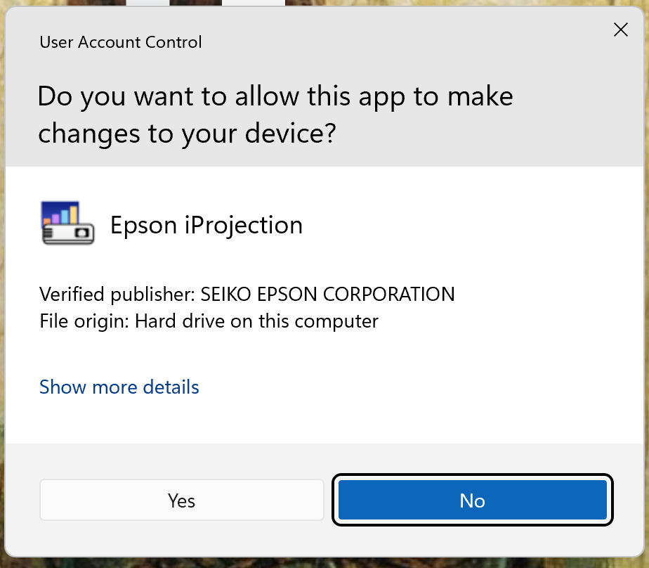

# Videoproiectoare Epson pe Windows

> Urmariti acest ghid pentru a va conecta wireless la videoproiectoarele Epson de pe un calculator cu Windows

## 1. Instalare


### - Descarcare
Accesati urmatorul link pentru a descarca aplicatia iProjection: [link descarcare](https://epson.com/support/wireless-projector-support)

Va trebui sa derulati pagina pana la urmatorul buton:
<p>
  <center>
    
  </center>
</p>

### - Pasii de instalare
Veti naviga catre fisierul descarcat (de forma iProf_X.YZ.exe, unde XYZ reprezinta versiunea programului) si veti da click dreapta, ```Open```
<p>
  <center>
    
  </center>
</p>

Urmatoarea fereastra va aparea. Va trebui sa apasati pe ```Yes```
<p>
  <center>
    
  </center>
</p>

Vom apasa pe ``OK`` pentru a continua
<p>
  <center>
    
  </center>
</p>

Apasam pe ```Next >``` pentru limba engleza
<p>
  <center>
    
  </center>
</p>

Aceasta fereastra va aparea, vom apasa pe ```Next```
<p>
  <center>
    
  </center>
</p>

Acceptam termenii cu butonul ```Yes```
<p>
  <center>
    
  </center>
</p>

Apasam pe ```Next >```
<p>
  <center>
    
  </center>
</p>


Super! Aplicatia s-a instalat si putem inchide apasand pe butonul ```Finish```:
<p>
  <center>
    
  </center>
</p>

Cautam aplicatia (bara de cautare, desktop etc.) si o deschidem
<p>
  <center>
    
  </center>
</p>

Acceptam termenii si conditiile
<p>
  <center>
    
  </center>
</p>

Refuzam participarea la colectare de date a modului de utilizare a aplicatiei.
<p>
  <center>
    
  </center>
</p>

Ne asiguram "Quick Connection Mode" este selectat, bifam casuta din dreptul "Set the selected Connection Mode as the default mode for future connections." si apasam pe ```OK```
<p>
  <center>
    
  </center>
</p>

In cazul in care urmatoarea fereastra apare, apasam pe ```Yes```
<p>
  <center>
    
  </center>
</p>

Apasam din nou pe ```Yes```
<p>
  <center>
    
  </center>
</p>
