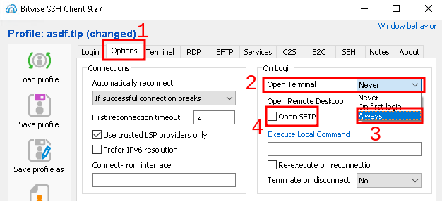
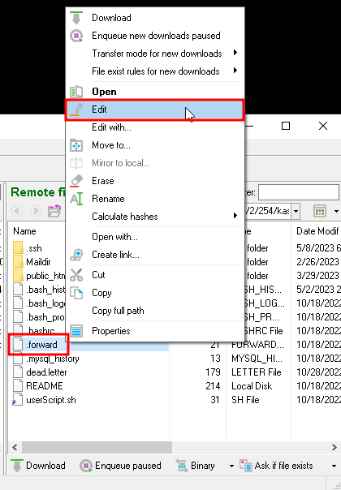
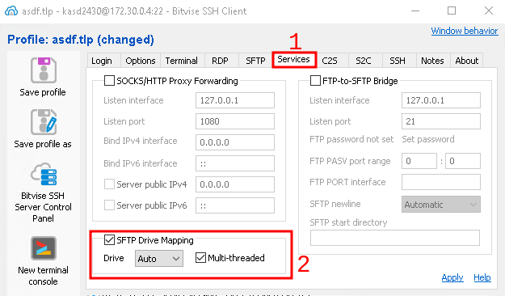
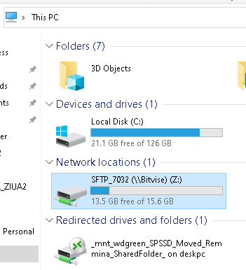
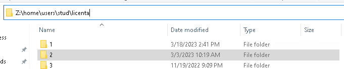

# Bitvise SSH - Utilizatori experimentati

## Deschideti SFTP & Terminal automat

Daca doriti, puteti face ca o fereastra `Terminal` si `SFTP` sa se deschida automat in cazul unei conexiuni reusite. Pentru a activa aceasta functie, accesati fila `Options` din Bitvise si setati optiunea `Open Terminal` la `Always` si bifati caseta de selectare `Open SFTP`, asa cum este ilustrat in imaginea de mai jos.

	

		
	

## Sincronizare SFTP

Din fereastra `SFTP`, puteti edita direct fisierele de pe server. Acest lucru se face facand clic dreapta pe un fisier la alegere, urmat de butonul `Edit`. Modificarile facute la fisierul deschis vor fi incarcate automat pe server, cu conditia ca fisierul sa aiba permisiunile corespunzatoare si sa fie editabil de catre dumneavoastra. 

Nu este nevoie sa descarcati mai intai acest fisier pentru a putea face modificari asupra lui. 

> Dupa ce ati facut modificari la un fisier, trebuie sa il salvati pentru ca modificarile sa fie incarcate efectiv pe server. 

Va rugam sa retineti ca aceasta functie functioneaza doar intr-un singur sens. Daca altcineva deschide si modifica fisierul pe care il editati, nu veti vedea modificarile sale pana cand nu redeschideti fisierul.

	

		
	

## Maparea discurilor SFTP

Daca aveti nevoie ca fisierele sa fie accesibile local, ca si cum ar fi stocate pe computerul dumneavoastra, puteti utiliza functia `SFTP Drive Mapping` a Bitvise, care este accesibila din fila `Services`. Activati aceasta caracteristica si bifati caseta de selectare `Multi-threaded` de langa ea pentru a obtine un spor de performanta in timp ce operati cu fisierele in acest mod. Consultati imaginea de mai jos pentru mai multe informatii.

	

		
	

> Este posibil sa fie nevoie sa va deconectati din Bitvise daca aveti o conexiune deschisa in timp ce activati aceasta functie. Dupa `Log in`, functia ar trebui sa functioneze corect.

Dupa activarea acestei functionalitati, ar trebui sa puteti vedea acum o noua `Unitate de retea` in `This PC`, asa cum este ilustrat mai jos.

	

		
	

> Aceasta functie monteaza unitatea `SFTP` la nivel local, dar va trebui sa navigati manual in dosarul de pornire. Daca nu aveti permisiuni adecvate pentru a lista directoarele de-a lungul traseului catre directorul personal, este posibil sa trebuiasca sa introduceti calea direct in fila de navigare a caii din `Windows Explorer`, asa cum este ilustrat mai jos.

	

		
	

