# Bitvise SSH

## Installing Bitvise SSH

Using a web browser, download the Bitvise SSH installer from [this link](https://dl.bitvise.com/BvSshClient-Inst.exe), which should directly download the appropiate installer. If that doesn't work, try [this link](https://www.bitvise.com/ssh-client-download) instead, which leads to the actual download page of the software. You can see the download button in the image below.

	

		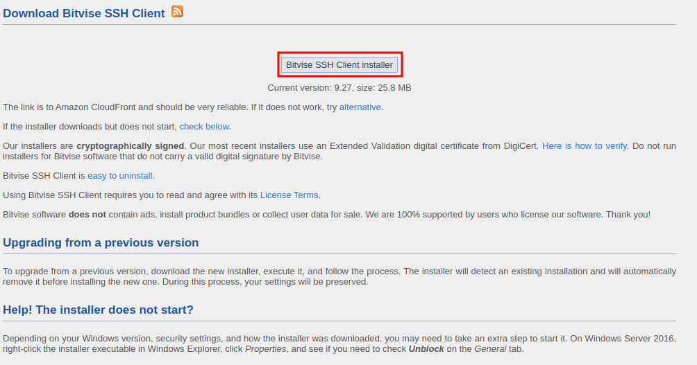
	

After the installer file has been downloaded, open it. You may be asked for administrative permissions in order to continue, just like in the image below. In this case, allow the modifications. You may be asked to enter your computer's password, if you have one (the one it asks you to enter when you power on your computer).

	

		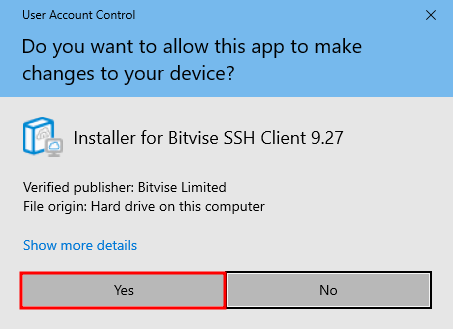
	

After the installer launches, you are asked to accept the software's terms and conditions. In order to proceed, tick the corresponding checkbox and proceed with the installation, as shown in the image below. 

	

		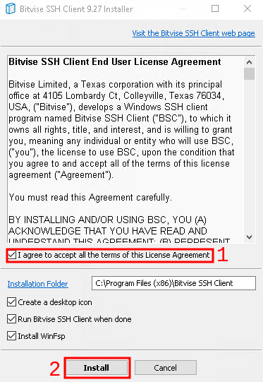
	

You may see a black box with files being copied by the installer. This is normal, and represents the way by which the software informs you of what is being done. After this step, you will be prompted to acknowledge the installation, as in the image below. Click OK.

	

		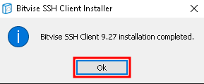
	

At this point, the main window of Bitvise SSH should open automatically. If it doesn't, you can find it's icon on the Desktop labelled accordingly.

## Configuring the keypair

> This step only has to be done once, in the beginning. This guide assumes you have not generated keys prior to this, and this the first one that you set up. 

### Generating keys

Click on the `Client key manager` field as indicated below. This will open the key manager interface.

	

		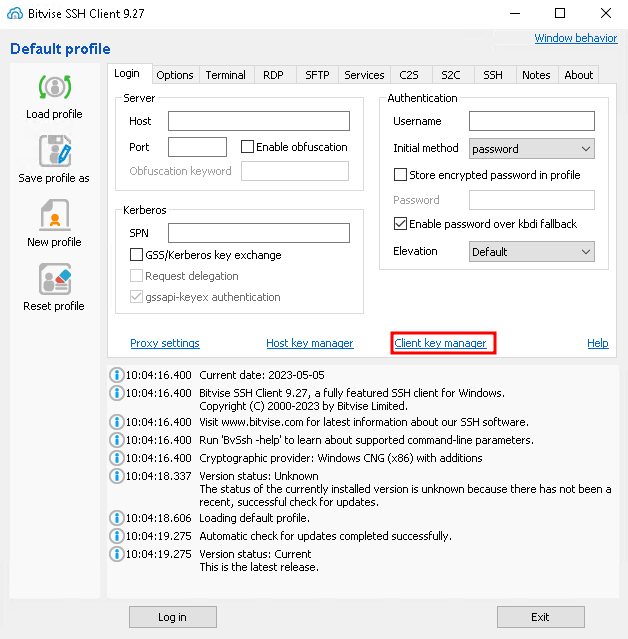
	

In the key generation interface, click on `Generate New`, which should bring you to the next step. Consult the image below. 

	

		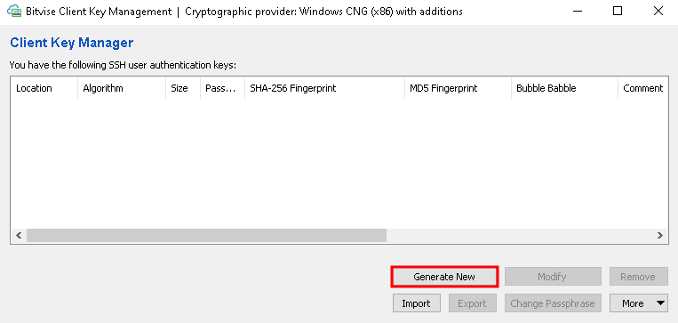
	

In the newly opened window, you are asked about setting a passphrase to your keypair. If you decide you need one, please enter the same passphrase in fields `1` and `2`, then proceed to generating your keypair by clicking `Generate`, on step `3`. See the image below for more instructions.

> This step is optional, but **highly recommended**. A keypair without a passphrase allows for passwordless login, but at the same time, in the event that the key gets stolen, the thief can also log into your account without the need for a password. It is up to you to decide how you want it, but it is also your responsability of taking care of your account. 

	

		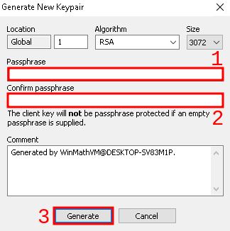
	

Congratiulations! Your keypair has now been generated. Please proceed to see details on how to install these keys on the server(s).

### Exporting the public key

Once you have your keypair ready, it's time to install it on the server. From the key manager interface, select the keypair you would like to use, and click `Export` as indicated in the picture below. 

> Please note that **you can use the same keypair for multiple servers**. You do not need to regenereate the keypair for each server you want to use it on. This way, you can think of this keypair as a general access card. 

	

		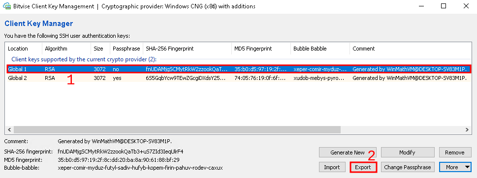
	

In the newly selected menu, choose `Export public key`. **Please make sure that the format of the key that you want to export is set to `OpenSSH format`**. After this, click on `Export`, like indicated in the picture below. 

	

		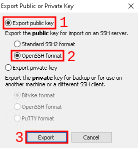
	

At this point you should be asked to save a file corresponding to the key itself. This file is the one that needs to be installed on the server. 

### Accessing the public key

> Depending on how comforatble you are with this process so far, you can choose to request assistance at this point, or to follow the guide to install this key file yourself. If you choose to request help, please send the file you have just saved to our IT team, along with the server and the associated username that you want to use it for. After this, you can skip this step. 

Open the file you have just saved using a text editor of your choice. For `Windows 10`, see the steps below. 

First, right click the file. Then click `Open With`, as shown in the image below. 

	

		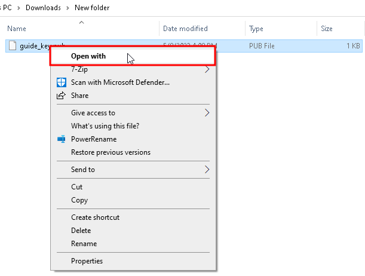
	

After this, make sure to untick the checkbox named `Always use this app to open .pub files`, as leaving it ticked may cause issues later. After that, click on `More apps`.

	

		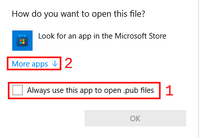
	

Now select `Notepad` from the list of applications, as shown below. After that, click `OK`. Make sure the checkbox indicated by point number `2` is still unchecked. 

	

		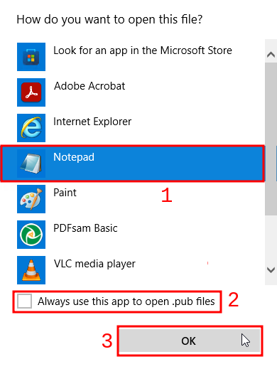
	

After this, a Notepad instance should open. Leave this window open, and copy the text inside.

### Installing the public key

Now that you have your public key at hand, depending on the server you want to install it on, you have two possible courses of action:

- **Easy method (Recommended)** - You can ask the IT administration to install this key for you
	- Send the text contained in the Notepad instance to the IT team. They will let you know when it's ready to use. After this, you can consider this step finished.
- **Complex method (Advanced)** - Install the key yourself
	- This procedure assumes you already know your way around modifying files under your account and is therefore considered an advanced procedure.

#### 1. Easy method (Recommended)

Send the `.pub` file you obtained at the previous step (or better yet, the contents of this file) to our IT administration. They will inform you when this configuration step is done. While you wait, you can go ahead and follow the rest of the guide (skipping the installation of the key, as this is all you need to do for now)

#### 2. Complex method (Advanced)

If you feel comfortable managing files and their contents on a server that you already have access to, what you need to do is to make sure a folder named `.ssh` exists in your home directory. You can do this by logging into the server under your account name, and typing `ls -la`. You should see the folders you have, which should look something like the output below. 

	# ls -la
	total 36
	drwx------  4 root root 4096 May  8 10:06 .
	drwxr-xr-x 17 root root 4096 Feb 22 13:25 ..
	-rw-------  1 root root 4449 May  8 10:06 .bash_history
	drwxr-xr-x  2 root root 4096 May  4 14:06 .ssh   <- THIS ONE

If it doesn't exist, you can create it by typing the following command:
	
	mkdir ~/.ssh

> Regardless of the folder's existence, you can create it just in case. In such a case, executing the creation command will, in the worst case, just return an error code and won't cause any harm. 

Once this folder is created, you can use the following command to append your public key to the `authorized_hosts` file in the `.ssh` directory, if one such file exists. Regardless, you can safely execute the following command:

	echo "THE_PUBLIC_KEY_FROM_NOTEPAD" >> ~/.ssh/authorized_keys

You need to replace the `THE_PUBLIC_KEY_FROM_NOTEPAD` placeholder with your actual public key, copied from Notepad. 

> With most existing SSH solutions, you can paste content into the terminal window by right clicking with your mouse. This way, you can type `echo "`, followed by a right click (which should paste what you copied before from the Notepad document), followed by typing the rest of the command manually: `" >> ~/.ssh/authorized_keys`. Please observe the prefix and suffix quotes, do not forget them. 

This is it! You have succesfully installed your public key. 

### Using your public key

Now that you have generated and installed your public key on the server, you must tell Bitvise to actually make use of it. In order to do so, from the main screen of Bitvise, change the `Initial method` from `password` to `publickey`, as indicated below. 

	

		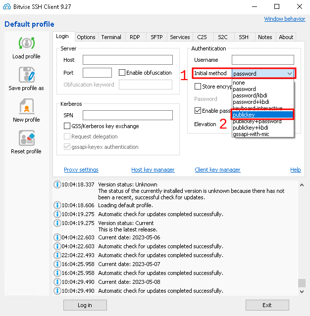
	

After selecting the specified option, you can now select which key to use with the server. It is advised to explicitely select the one you want to use, rather than leaving the software to decide, as indicated in the picture below. 

	

		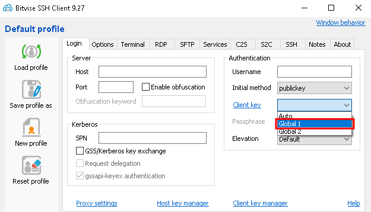
	

Now you can fill in your username, host and port of the server, as indicated in the image below.

	

		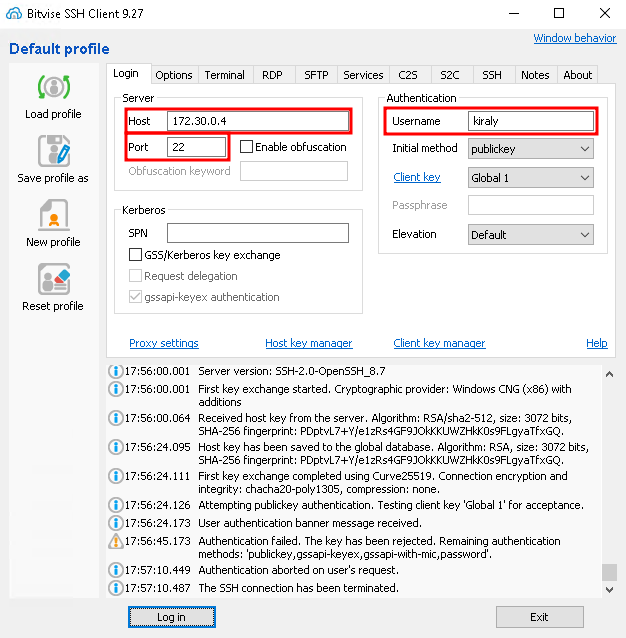
	

> At this point you can use the `Save profile as` button on the left menu to save your `Host`, `Port` and `Username` fields, along with other modifications you have made. Similarly, to load these settings, just use the `Load profile` button. If you've made changes to a profile which has already been saved, you can save these changes by using the `Save profile` button. 
>> The public keys you have generated are saved and taken account of regardless of whether or not you save your changes using this method. This saving is just for your future convenience, to avoid having to fill in these fields again, selecting the key, and so on. 

### Connecting to the server

Assuming everything went well, you should now be able to connect to the server using your selected key pair. In order to do so, use the `Log in` button from the bottom of the screen, as indicated below. This button will turn into `Log out` after a successful connection. 

	

		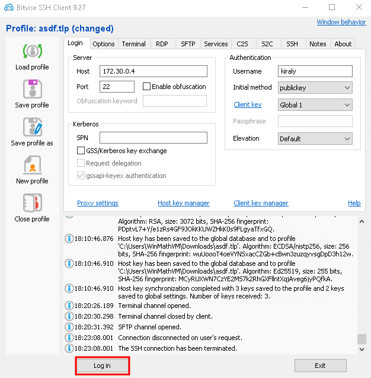
	

> You may be prompted to enter your keypair's passphrase, if you have set one, as suggested. Remember this is **not** your account's password, but the key's password which you've set at the `Generating Keys` step.

#### Connecting - Failure
> If you haven't configured your public key correctly on either side, you may be asked to enter your password. If this happens, simply abort this step, and check if you followed this guide correctly.

If you failed to configure the key correctly, you may see a screen similar to the one shown in the image below. 

	

		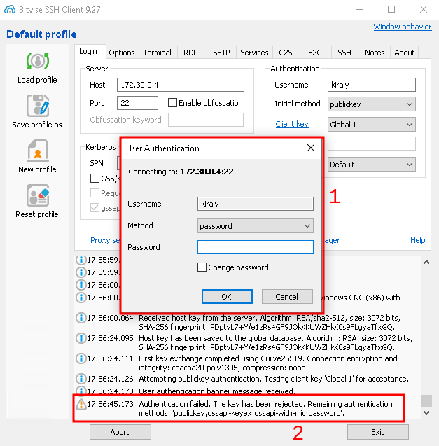
	

In this image, you can see area number `1`, which is prompting you for a password. You can also see area number `2`, which tells you authentication has failed with the configured `publickey`, and is therefore trying other authentication methods (which you do not want to do).

#### Connecting - Success

If however you are successful, you should see a screen similar to the one shown below. 

> You may see a `User authentication banner`. This is usually informative, and is safe to close. 

	

		
	

You can now open a `Terminal` (or more of them if you want) as well as `SFTP` windows, as indicated in the image above by fields `1` and `2` respectively. 

Congratiulations! You have successfully set up the Bitvise SSH Client for use with servers of your choice, using public key authentication mechanisms.

If you want to get more out of Bitvise, please consult the guide for power users.
