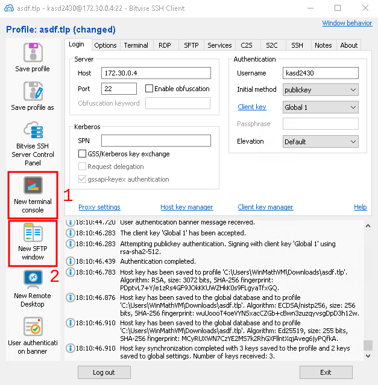

# Bitvise SSH

## Instalarea Bitvise SSH

Folosind un browser web, descarcati programul de instalare Bitvise SSH de la [acest link](https://dl.bitvise.com/BvSshClient-Inst.exe), care ar trebui sa descarce direct programul de instalare corespunzator. Daca nu functioneaza, incercati in schimb [acest link](https://www.bitvise.com/ssh-client-download), care duce la pagina de descarcare efectiva a software-ului. Puteti vedea butonul de descarcare in imaginea de mai jos.

	

		
	

Dupa ce fisierul de instalare a fost descarcat, deschideti-l. Este posibil sa vi se ceara permisiuni administrative pentru a continua, la fel ca in imaginea de mai jos. In acest caz, permiteti modificarile. Este posibil sa vi se ceara sa introduceti parola computerului, daca aveti una (cea pe care vi se cere sa o introduceti atunci cand porniti calculatorul).

	

		
	

Dupa lansarea programului de instalare, vi se cere sa acceptati termenii si conditiile programului. Pentru a continua, bifati caseta de selectare corespunzatoare si continuati instalarea, asa cum este ilustrat in imaginea de mai jos.

	

		
	

Este posibil sa vedeti o caseta neagra cu fisiere copiate de programul de instalare. Acest lucru este normal si reprezinta modul in care software-ul va informeaza despre ceea ce se face. Dupa acest pas, vi se va cere sa confirmati instalarea, ca in imaginea de mai jos. Faceti clic pe OK.

	

		
	

In acest moment, fereastra principala a Bitvise SSH ar trebui sa se deschida automat. Daca nu se deschide, puteti gasi pictograma sa pe desktop cu denumirea corespunzatoare.

## Configurarea perechii de chei

> Acest pas trebuie facut o singura data, la inceput. Acest ghid porneste de la premisa ca nu ati generat chei inainte de acest pas si ca aceasta este prima pereche de chei pe care o configurati. 

### Generarea cheilor

Faceti clic pe campul `Client key manager`, asa cum este indicat mai jos. Acest lucru va deschide interfata managerului de chei.

	

		
	

In interfata de generare a cheilor, faceti clic pe `Generate New`, care ar trebui sa va duca la urmatorul pas. A se consulta imaginea de mai jos.

	

		
	

In fereastra nou deschisa, vi se cere sa setati o fraza de acces pentru perechea de chei. Daca decideti ca aveti nevoie de una, va rugam sa introduceti aceeasi fraza de acces in campurile `1` si `2`, apoi treceti la generarea perechii de chei facand clic pe `Generate`, la pasul `3`. Pentru mai multe instructiuni, consultati imaginea de mai jos.

> Acest pas este optional, dar **recomandat in mod deosebit**. O pereche de chei fara o fraza de acces permite autentificarea fara parola, dar, in acelasi timp, in cazul in care cheia este furata, hotul se poate autentifica in contul dumneavoastra fara a avea nevoie de o parola. Depinde de dumneavoastra sa decideti cum doriti, dar este, de asemenea, responsabilitatea dumneavoastra de a avea grija de contul personal.

	

		
	

Felicitari! Perechea de chei a fost generata. Va rugam sa continuati pentru a vedea detalii despre cum sa instalati aceste chei pe server(e).

### Exportarea cheii publice

Odata ce aveti perechea de chei pregatita, este timpul sa o instalati pe server. Din interfata managerului de chei, selectati perechea de chei pe care doriti sa o folositi si faceti clic pe `Export`, asa cum este indicat in imaginea de mai jos. 

> Va rugam sa retineti ca **poateti utiliza aceeasi pereche de chei pentru mai multe servere**. Nu este necesar sa regenerezi perechea de chei pentru fiecare server pe care doriti sa o utilizati. In acest fel, puteti considera aceasta pereche de chei ca pe un card de acces general care va reprezinta.

	

		
	

In meniul nou selectat, alegeti `Export public key`. **Asigurati-va ca formatul cheii pe care doriti sa o exportati este setat la `OpenSSH format`**. Dupa aceasta, faceti clic pe `Export`, asa cum este indicat in imaginea de mai jos.

	

		
	

In acest moment, ar trebui sa vi se ceara sa salvati un fisier corespunzator cheii in sine. Acest fisier este cel care trebuie sa fie instalat pe server. 

### Accesarea cheii publice

> In functie de cat de confortabil va simtiti cu acest proces pana acum, puteti alege sa solicitati asistenta in acest punct sau sa urmati ghidul pentru a instala singur acest fisier al cheii. Daca alegeti sa solicitati ajutor, va rugam sa trimiteti fisierul pe care tocmai l-ati salvat echipei noastre IT, impreuna cu serverul si numele de utilizator asociat pentru care doriti sa il utilizati. Dupa aceasta, puteti sari peste acest pas. 

Deschideti fisierul pe care tocmai l-ati salvat folosind un editor de text la alegere. Pentru `Windows 10`, consultati pasii de mai jos. 

In primul rand, faceti clic dreapta pe fisier. Apoi faceti clic pe `Open With`, asa cum este ilustrat in imaginea de mai jos.

	

		
	

Dupa aceasta, asigurati-va ca debifati caseta de selectare numita " Always use this app to open .pub files`", deoarece daca o lasati bifata poate cauza probleme mai tarziu. Dupa aceea, faceti clic pe "More apps" (Mai multe aplicatii).

	

		
	

Acum selectati `Notepad` din lista de aplicatii, asa cum se arata mai jos. Dupa aceea, faceti clic pe `OK`. Asigurati-va ca caseta de selectare indicata de numarul de puncte `2` este inca debifata.

	

		
	

Dupa aceasta etapa, ar trebui sa se deschida o instanta Notepad. Lasati aceasta fereastra deschisa si copiati textul din interior.

### Instalarea cheii publice

Acum ca aveti cheia publica la indemana, in functie de serverul pe care doriti sa o instalati, aveti doua posibilitati de a continua:

- **Metoda usoara (recomandata)** - Puteti cere administratiei IT sa instaleze aceasta cheie pentru dumneavoastra.
	- Trimiteti textul continut in instanta Notepad catre echipa IT. Acestia va vor anunta cand va fi gata de utilizare. Dupa aceasta, puteti considera acest pas incheiat.
- **Metoda complexa (avansata)** - Instalati cheia dumneavoastra insusi
- Aceasta procedura presupune ca stiti deja cum sa modificati fisierele din contul personal si, prin urmare, este considerata o procedura avansata.

#### 1. Metoda usoara (recomandata)

Trimiteti fisierul `.pub` pe care l-ati obtinut la pasul anterior (sau, mai bine zis, continutul acestui fisier) catre administratia noastra IT. Acestia va vor informa atunci cand aceasta etapa de configurare este finalizata. In timp ce asteptati, puteti continua sa urmati restul ghidului (sarind peste instalarea cheii, deoarece aceasta este tot ce trebuie sa faceti deocamdata).

#### 2. Complex method (Advanced)

#### 2. Metoda complexa (avansata)

Daca va simtiti confortabil sa gestionati fisierele si continutul acestora pe un server la care aveti deja acces, ceea ce trebuie sa faceti este sa va asigurati ca in directorul personal exista un folder numit `.ssh`. Puteti face acest lucru conectandu-va la server sub numele contului dumneavoastra si tastand `ls -la`. Ar trebui sa vedeti folderele pe care le aveti, care ar trebui sa arate ceva asemanator cu rezultatul de mai jos. 

	# ls -la
	total 36
	drwx------  4 root root 4096 May  8 10:06 .
	drwxr-xr-x 17 root root 4096 Feb 22 13:25 ..
	-rw-------  1 root root 4449 May  8 10:06 .bash_history
	drwxr-xr-x  2 root root 4096 May  4 14:06 .ssh   <----- ACESTA

Daca nu exista, il puteti crea tastand urmatoarea comanda:

	mkdir ~/.ssh

> Indiferent de existenta folderului, il puteti crea pentru orice eventualitate. In acest caz, executarea comenzii de creare va returna, in cel mai rau caz, doar un cod de eroare si nu va cauza nicio paguba. 

Dupa ce acest folder este creat, puteti utiliza urmatoarea comanda pentru a adauga cheia publica la fisierul `authorized_hosts` din directorul `.ssh`, daca exista un astfel de fisier. In orice caz, puteti executa fara riscuri urmatoarea comanda:

	echo "THE_PUBLIC_KEY_FROM_NOTEPAD" >> ~/.ssh/authorized_keys

Trebuie sa inlocuiti simbolul `THE_PUBLIC_KEY_FROM_NOTEPAD` cu cheia dvs. publica reala, copiata din Notepad. 

> Cu majoritatea solutiilor SSH existente, puteti lipi continutul in fereastra terminalului facand clic dreapta cu mouse-ul. In acest fel, puteti tasta `echo"`, urmat de un clic dreapta (care ar trebui sa lipeasca ceea ce ati copiat inainte din documentul Notepad), urmat de tastarea manuala a restului comenzii: `" >> ~/.ssh/authorized_keys`. Va rugam sa tineti cont de ghilimelele de prefix si sufix, nu le uitati. 

Atat! Ati instalat cu succes cheia publica.

### Utilizarea cheii publice

Acum, dupa ce ati generat si instalat cheia publica pe server, trebuie sa ii spuneti lui Bitvise sa o foloseasca concret. Pentru a face acest lucru, din ecranul principal al Bitvise, schimbati `Initial method` din `password` in `publickey`, asa cum este indicat mai jos.

	

		
	

Dupa selectarea optiunii specificate, puteti selecta acum ce cheie sa utilizati cu serverul. Se recomanda sa o selectati in mod explicit pe cea pe care doriti sa o utilizati, in loc sa lasati software-ul sa decida, asa cum se indica in imaginea de mai jos.

	

		
	

Acum puteti introduce numele de utilizator, adresa si portul serverului, asa cum se arata in imaginea de mai jos.

	

		
	

> In acest moment puteti folosi butonul "Save profile as" din meniul din stanga pentru a salva campurile `Host`, `Port` si `Username`, impreuna cu alte modificari pe care le-ati facut. In mod similar, pentru a incarca aceste setari, folositi doar butonul `Load profile`. Daca ati facut modificari la un profil care a fost deja salvat, puteti salva aceste modificari folosind butonul `Save profile`. 
>> Cheile publice pe care le-ati generat sunt salvate si luate in considerare indiferent daca salvati sau nu modificarile prin aceasta metoda. Aceasta salvare este doar pentru confortul dumneavoastra viitor, pentru a evita sa completati din nou aceste campuri, sa selectati cheia si asa mai departe.

### Conectarea la server

Presupunand ca totul a mers bine, ar trebui sa va puteti conecta la server folosind perechea de chei selectata. Pentru a face acest lucru, utilizati butonul `Log in` din partea de jos a ecranului, asa cum este indicat mai jos. Acest buton se va transforma in `Log out` dupa realizarea cu succes a conexiunii.

	

		
	

> Este posibil sa vi se solicite sa introduceti fraza de acces a perechii de chei, daca ati setat una, asa cum vi s-a sugerat. Nu uitati ca aceasta **nu este** parola contului dumneavoastra, ci parola cheii pe care ati setat-o la etapa `Generating Keys`.

#### Conectare - Cazul de esec
> Daca nu v-ati configurat corect cheia publica in ambele parti, este posibil sa vi se ceara sa introduceti parola. Daca se intampla acest lucru, pur si simplu abandonati acest pas si verificati daca ati urmat corect acest ghid.

Daca nu ati reusit sa configurati corect cheia, este posibil sa vedeti un ecran similar cu cel prezentat in imaginea de mai jos.

	

		
	

In aceasta imagine, puteti vedea zona cu numarul `1`, care va solicita o parola. Puteti vedea, de asemenea, zona numarul `2`, care va spune ca autentificarea a esuat folosind `publickey` (cheia publica) configurata si, prin urmare, se incearca alte metode de autentificare (ceea ce nu doriti sa faceti).

#### Connecting - Cazul de succes

Daca insa reusiti, ar trebui sa vedeti un ecran asemanator cu cel prezentat mai jos. 

> Este posibil sa vedeti un `User authentication banner`. Acesta este, de obicei, informativ si se poate inchide fara probleme.

	

		
	

Acum puteti deschide o fereastra `Terminal` (sau mai multe, daca doriti), precum si o fereastra `SFTP`, asa cum este indicat in imaginea de mai sus prin campurile `1` si, respectiv, `2`. 

Felicitari! Ati reusit sa configurati cu succes clientul SSH Bitvise pentru a fi utilizat cu serverele pe care le alegeti, folosind mecanisme de autentificare cu cheie publica.

Daca doriti sa obtineti mai mult de la Bitvise, va rugam sa consultati ghidul pentru utilizatorii experimentati.
