# Aspect fizic al tablei

	

		
	

Pe partea din fata a tablei puteti identifica urmatoarele elemente: 
- Stylus-urile magnetice, atasate la partea de jos a tablei, evidentiate cu verde in imagine. 
- Butonul fizic **Home**, situat in mijlocul ramei, spre partea de jos. Acesta este evidentiat cu rosu in imagine. Folosind acest buton, aveti acces rapid la meniul contextual.

	

		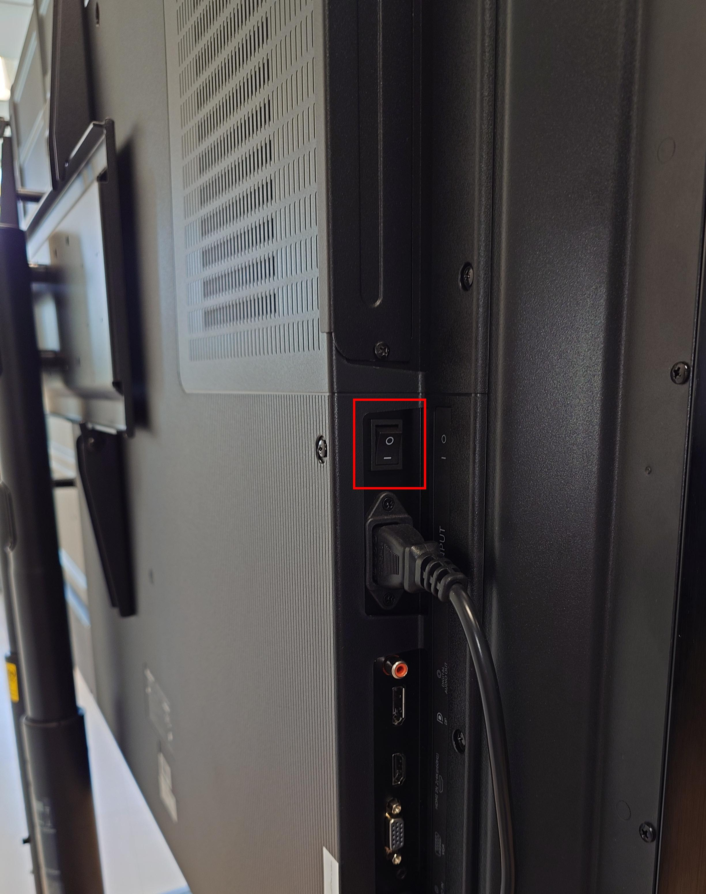
	

Pe partea laterala stanga a tablei se afla butonul fizic de **Pornire/Oprire**, incadrat cu rosu in imagine. Acesta intrerupe complet alimentarea tablei.

---

# Softul tablei
## Introducere

	

		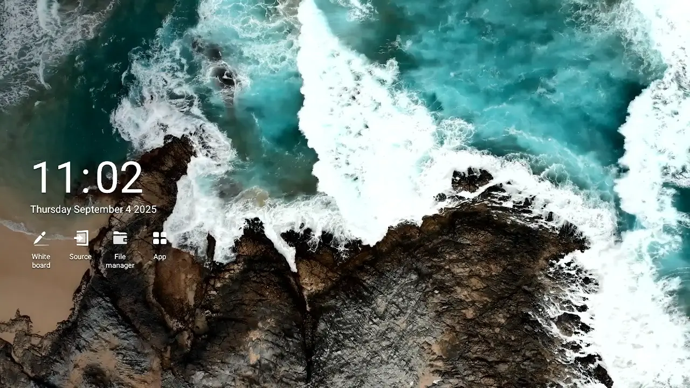
	

Ecranul principal afiseaza data si ora, precum si meniul de baza. De aici pot fi accesate aplicatiile principale: `Whiteboard`, `Source`, `File Manager` si `App`.

> Butonul **Home** permite revenirea la acest meniu in orice moment.

## Selectarea sursei HDMI

	

		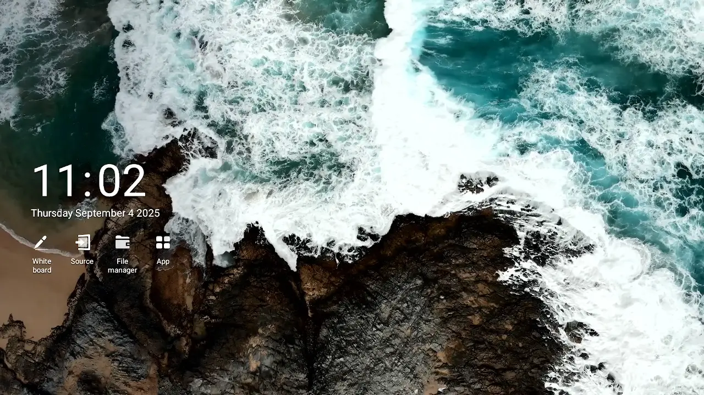
	

> Puteti accesa aceasta optiune si din meniul contextual, apasand butonul fizic **Home**. 

Prin optiunea **Source**, disponibila pe ecranul principal se selecteaza dispozitivul conectat prin HDMI.
- **HDMI-Input1** corespunde portului HDMI din partea din fata a tablei.
- **HDMI-Input2** corespunde portului HDMI din partea laterala a tablei.

Semnalul video selectat va fi afisat pe tabla dupa selectie.

## Adnotarea peste semnalul HDMI

	

		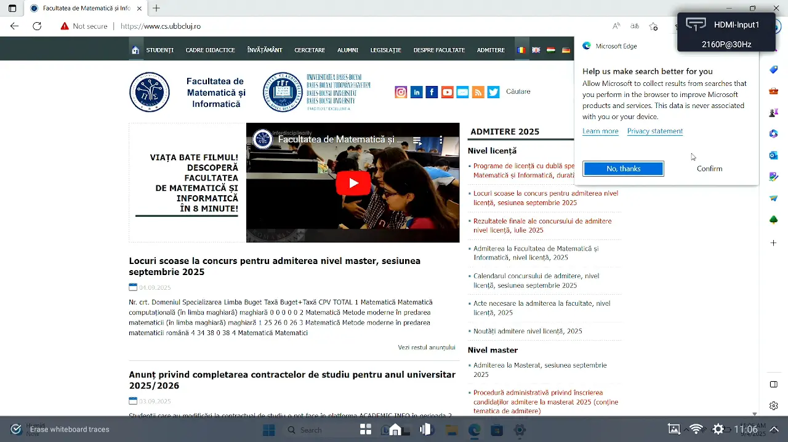
	

<!-- > To activate adnotation, press the physical **Home** button and select the **Note** application.
>
> **Attention:** The image displayed from **HDMI** will be frozen as long as the **Note** application is active.

It is possible freeze the image displayed via HDMI and draw on top of it. This mode is active when the text `Remark status` is displayed in the upper half of the image. In order to exit this mode and revert back to the live image, press the `X` button from the bottom half of the board, as illustrated in the picture.-->

> Pentru a activa adnotarea, apasati butonul fizic **Home** si selectati aplicatia **Note**.

Este posibila inghetarea imaginii afisate prin HDMI si desenarea peste aceasta. Acest mod este activ atunci cand textul `Remark status` este afisat in jumatatea superioara a ecranului. Pentru a iesi din acest mod si a reveni la imaginea live, apasati butonul `X` din jumatatea inferioara a ecranului, asa cum este ilustrat in imagine.

> **Atentie:** Imaginea afisata prin **HDMI** va fi inghetata cat timp aplicatia **Note** este activa.

## Pornirea tablei albe (Whiteboard)

	

		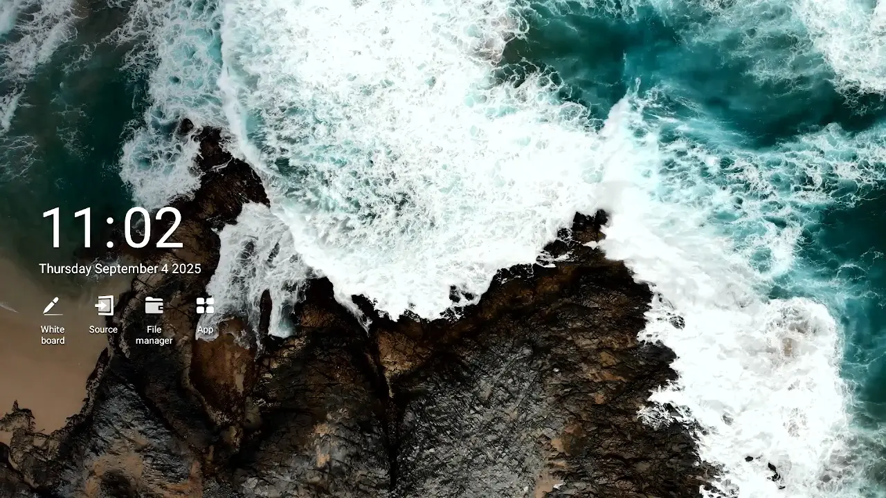
	

<!-- > You can also access this application from the contextual menu, pressing the physical **Home** button. 

The whiteboard is available from the main menu. It allows drawing, saving and managing multiple board sessions simultanously. -->

> Puteti accesa aceasta aplicatie si din meniul contextual, apasand butonul fizic **Home**. 

Pentru a porni aplicația Whiteboard, navigați la meniul principal și apăsați pe pictograma `Whiteboard`. Tabla alba este disponibila din meniul principal. Aceasta permite desenarea, salvarea si gestionarea simultana a mai multor sesiuni de scriere pe tabla. 

<!--## Activarea modului de desen

	

		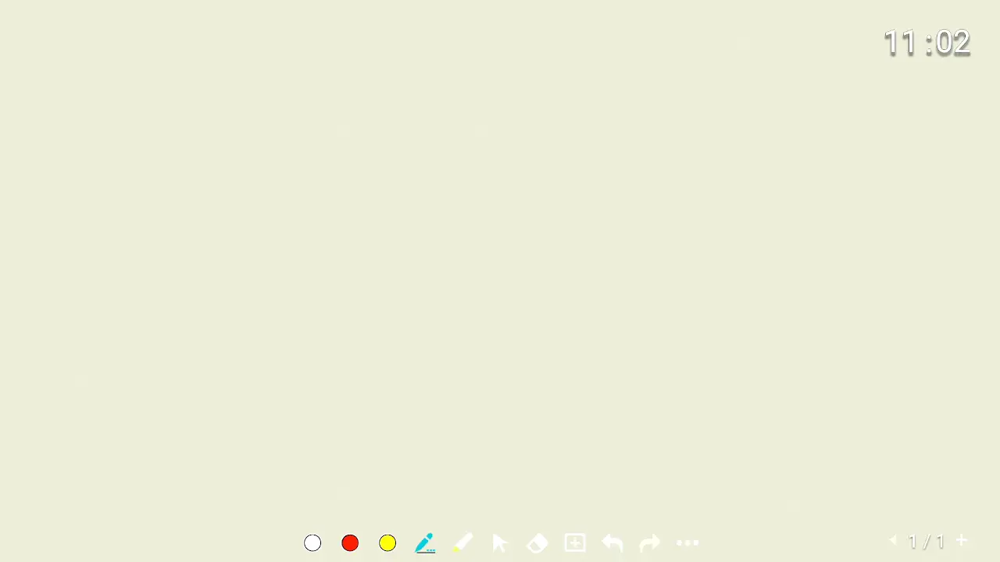
	

-->

## Alegerea culorii creionului

	

		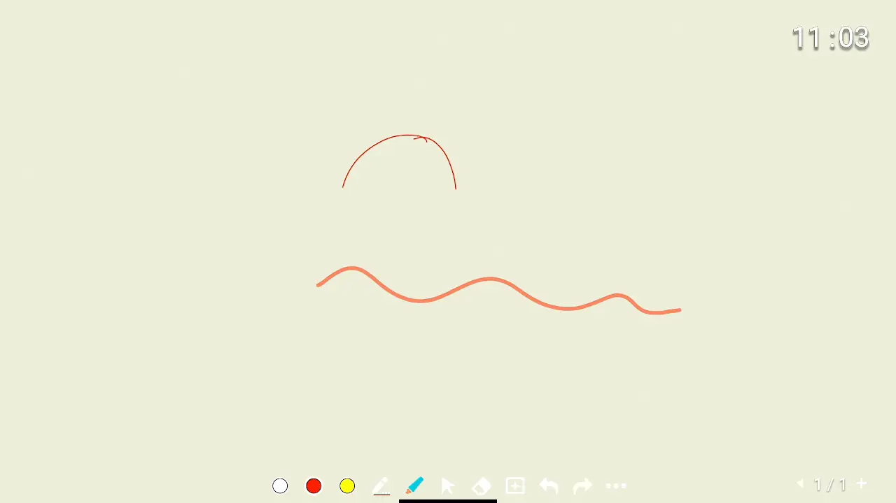
	

Culoarea instrumentului `Creion` poate fi selectata dintr-o paleta de culori incorporata. Este posibila si adaugarea de culori personalizate, dar acest lucru nu este abordat in acest ghid.

La apasarea pictogramei `Creion` din panoul de instrumente din partea de jos, se afiseaza un meniu. Dupa selectarea culorii dorite, instrumentul va desena respectand alegerea dvs. 

Puteti vedea o previzualizare a alegerii facute deasupra zonei paletei de culori. 

## Alegerea grosimii creionului

	

		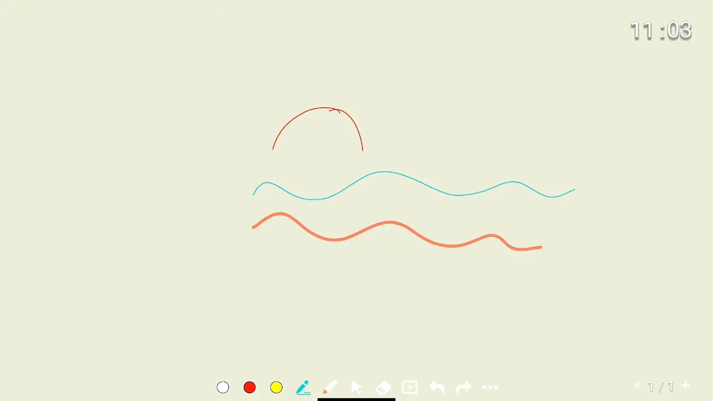
	

Grosimea de desen a instrumentului `Creion` poate fi ajustata din panoul de instrumente din partea de jos, apasand pe pictograma `Creion`. Dupa afisarea meniului, selectati grosimea preferata din partea stanga a paletei de culori.

Puteti vedea o previzualizare a alegerii facute deasupra zonei paletei de culori. 

## Alegerea culorii markerului

	

		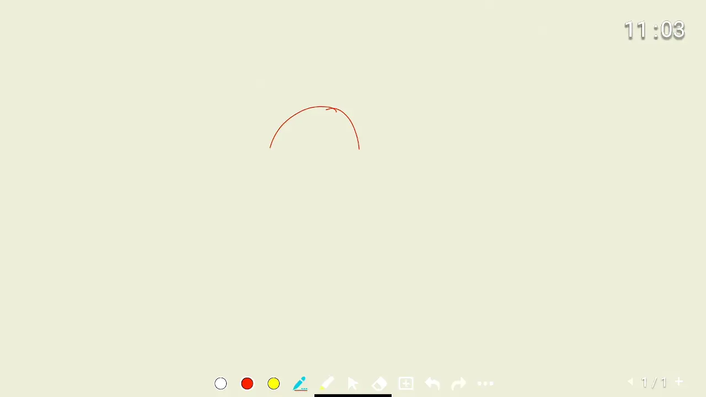
	

> Va rugam sa aveti in vedere faptul ca instrumentul **Marker** nu este destinat scrierii si desenarii, ci evidentierii. Daca doriti sa scrieti pe tabla, utilizati instrumentul **Creion**. 

Culoarea instrumentului marker poate fi reglata dintr-o paleta fixa de sase culori, apasand pe pictograma `Marker` din panoul de instrumente din partea de jos. Alegeti culoarea dorita din meniul care se deschide. 

## Stergerea completa a continutului

	

		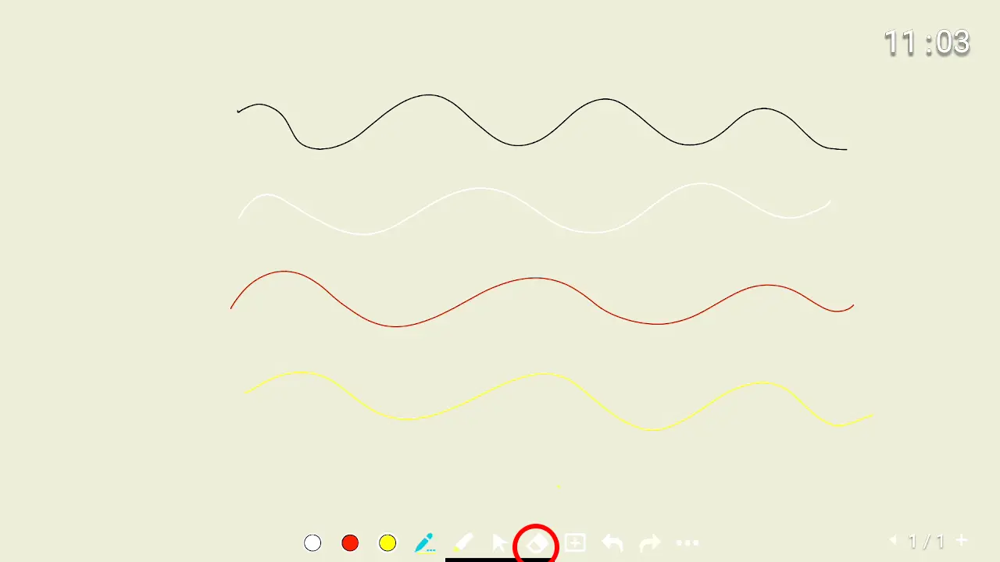
	

Tabla de scris poate fi stearsa complet prin selectarea pictogramei `Radiera` din panoul de instrumente din partea de jos. Dintre modurile de stergere disponibile, stergerea panoului necesita apasarea si apoi glisarea spre dreapta pe cursorul `Swipe right to clear` care este afisat in meniu.

Apare o confirmare, indicand faptul ca ecranul a fost sters.

## Stergerea partiala a continutului

	

		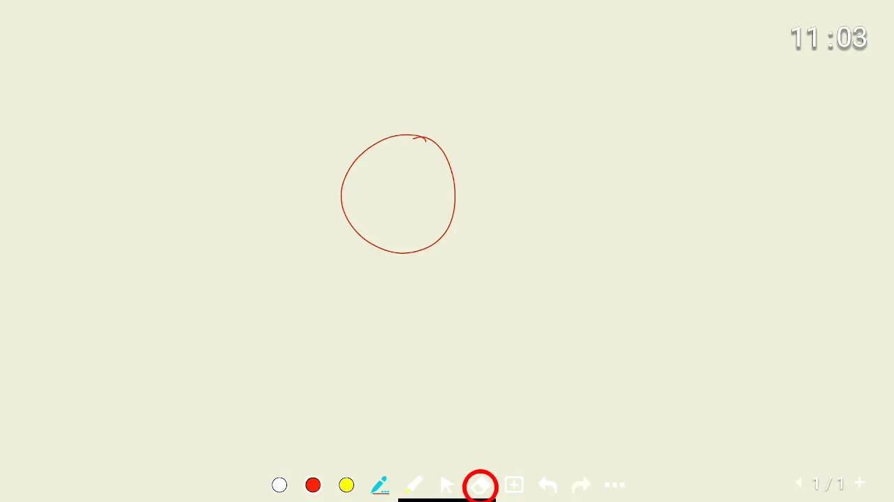
	

<!--Partial erasing can be achieved by selecting the `Eraser` icon from the bottom instrument panel. From the available menu items, choose `Partial`. Then, using your finger or the stylus, circle the area you want to erase, as indicated in the picture. 

> If you are looking for a clasic eraser, select the **Radiera** tool from the available menu items and proceed to draw, using your finger or the stylus, on top of what you want to delete.-->

Stergerea partiala poate fi realizata prin selectarea pictogramei `Radiera` din partea de jos a panoului de instrumente. Din meniul disponibil, selectati `Partial`. Apoi, folosind degetul sau stylusul, incercuiti zona pe care doriti sa o stergeti, asa cum este indicat in imagine. 

> Daca doriti un "burete" clasic, selectati instrumentul **Radiera** din elementele de meniu disponibile si procedati la desenarea, folosind degetul sau stylusul, deasupra a ceea ce doriti sa stergeti.

## Adaugarea unei noi pagini

	

		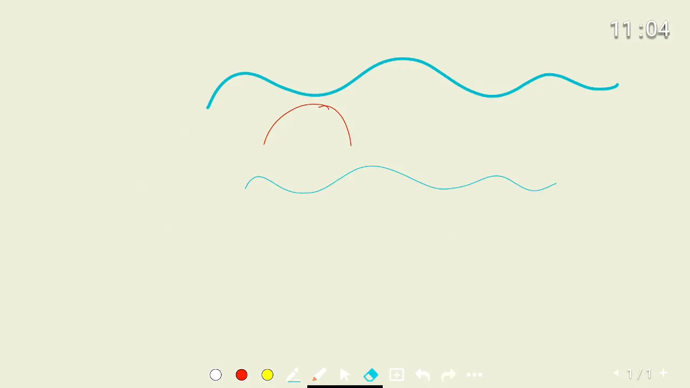
	

<!--Adding a new page allows you to move a to a blank screen while keeping your previous writing available and returned to at a later point in time. In order to add a new page, use the `+` symbol located in the buttom right corner of the whiteboard screen.

Upon pressing, a new page will immediately show up blank, and a confirmation menu will display, indicating the page you are currently on.

You may note that the page indicator situated to the left of the `+` symbol has now increased, placing you to the last available page (the one you just created). -->

Adaugarea unei pagini noi va permite sa treceti la un ecran alb, pastrand in acelasi timp scrisul anterior disponibil pentru a putea reveni la el ulterior. Pentru a adauga o pagina noua, apasati simbolul `+` situat in coltul din dreapta jos al ecranului.

La apasarea butonului, va aparea imediat o pagina noua goala, iar un meniu de confirmare va fi afisat, indicand pagina pe care va aflati in prezent.

Puteti observa ca indicatorul de pagina situat in stanga simbolului `+` a crescut dupa adaugarea noii pagini, plasandu-va la ultima pagina disponibila, cea pe care tocmai ati creat-o.

## Schimbarea paginii afisate

	

		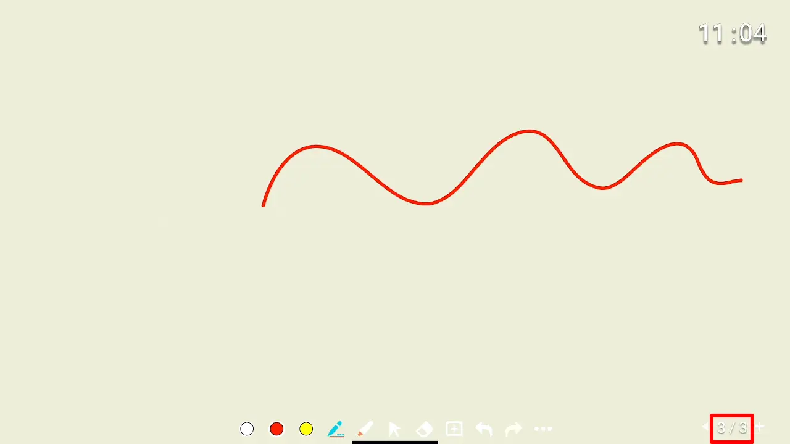
	

<!-- Changing the displayed page can be achieved by pressing on the text displaying the page count (for example, `3/3`), situated to the left of the `+` button used for adding new pages. 

Upon pressing, a new menu is displayed showing the available pages. These can be scrolled through using your finger or the stylus. In order to change the active page, select it from the menu.

After changing the page, press anywhere else to close the menu. -->

Schimbarea paginii afisate se poate realiza apasand pe textul care afiseaza numarul de pagini (de exemplu, `3/3`), situat in stanga butonului `+` utilizat pentru adaugarea de noi pagini. 

La apasare, este afisat un nou meniu care prezinta paginile disponibile. Acestea pot fi derulate folosind degetul sau stylusul, in cazul in care sunt prea multe. Pentru a schimba pagina activa, selectati-o din meniu.

Dupa schimbarea paginii, apasati oriunde altundeva pentru a inchide meniul.

## Stergerea unei pagini

	

		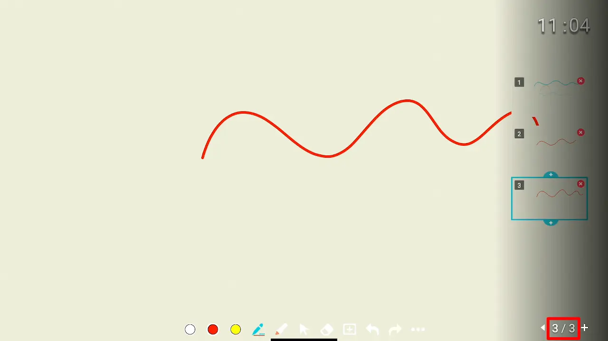
	

<!--Page deletion is achieved from the same menu that is used to change the pages. Upon pressing the text that shows the number of pages (for example, `3/3`), the available pages are shown.

Each screen thumbnail has a red `X` in it's upper right corner. If you want to delete a particular one, press it's `X` symbol, and confirm your intent in the dialog that pops up on the screen.-->

Stergerea paginilor se realizeaza din acelasi meniu care este utilizat pentru schimbarea paginilor. La apasarea textului care arata numarul de pagini (de exemplu, `3/3`), sunt afisate paginile disponibile.

Fiecare miniatura a ecranului are un `X` rosu in coltul sau din dreapta sus. Daca doriti sa stergeti una anume, apasati simbolul `X` al acesteia si confirmati-va intentia in dialogul care apare pe ecran.

## Salvarea continutului ca PDF

	

		
	

<!-- > **Attention:** Saving to a USB device might require formatting it with a FAT32 filesystem. Official tests were executed using a FAT32 device. If yours uses a different format, your mileage may vary.

It is possible to save all your boards on a `USB stick`, in a PDF format. In the resulting file, each page from the board corresponds to a page in the document.

Insert your USB device into one of the available slots on the front side of the board, in the bottom left corner. If it is successfuly recognized, a menu will show up mentioning `New device detected`. From said menu, click `Cancel`, as it is a prompt to open the device for browsing it's file, and is unrelated to the intent of saving to it. 

From the bottom instrument panel, select the menu with three dots, as shown in the image above. The `Save Board` option will prompt you where to save the board. Select your device from the menu, and click `OK`. A message confirming the save is then displayed in the middle of the board.

> Be careful not to immediately remove the USB stick, as we've encountered corruption in our tests. Wait 5-10 seconds before unplugging your device to prevent data loss. -->

> **Atentie:** Salvarea pe un dispozitiv USB poate necesita formatarea acestuia cu un sistem de fisiere FAT32. Testele oficiale au fost efectuate utilizand un dispozitiv FAT32. Daca al dumneavoastra utilizeaza un format diferit, rezultatul poate varia.

Este posibila salvarea tuturor desenelor pe un `USB stick`, in format PDF. In fisierul rezultat, fiecare pagina din tabla corespunde unei pagini din document.

Introduceti dispozitivul USB in unul dintre sloturile disponibile pe partea frontala a tablei, in coltul din stanga jos. Daca acesta este recunoscut cu succes, va aparea un meniu cu mentiunea `New device detected`. Din meniul respectiv, faceti clic pe `Cancel` (Anulare), deoarece este o solicitare de a deschide dispozitivul pentru a parcurge continutul fisierului si nu are legatura cu intentia de a salva pe acesta. 

Din panoul de instrumente de jos, selectati meniul cu trei puncte, asa cum se arata in imaginea de mai sus. Optiunea `Save Board` va va intreba unde sa salvati fisierul. Selectati dispozitivul dumneavoastra din meniu si faceti clic pe `OK`. Un mesaj de confirmare a salvarii este apoi afisat in mijlocul tablei.

> Aveti grija sa nu scoateti imediat stick-ul USB, deoarece am intalnit cazuri de corupere in testele noastre. Asteptati 5-10 secunde inainte de a va deconecta dispozitivul pentru a preveni pierderea datelor. 

## Revenirea la meniul principal

	

		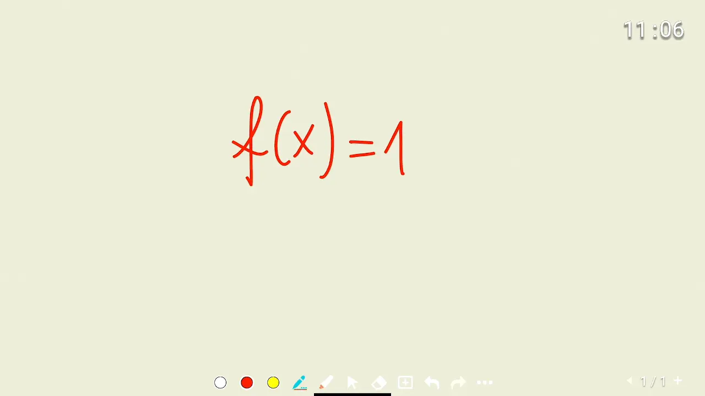
	

<!--The easiest way to get to the main menu is by pressing the physical **Home** button, followed by pressing the digital **Home** button that is available in the newly open context menu. -->

Cel mai simplu mod de a ajunge la meniul principal este prin apasarea butonului fizic **Home**, urmata de apasarea butonului digital **Home** care este disponibil in meniul contextual nou deschis. 
