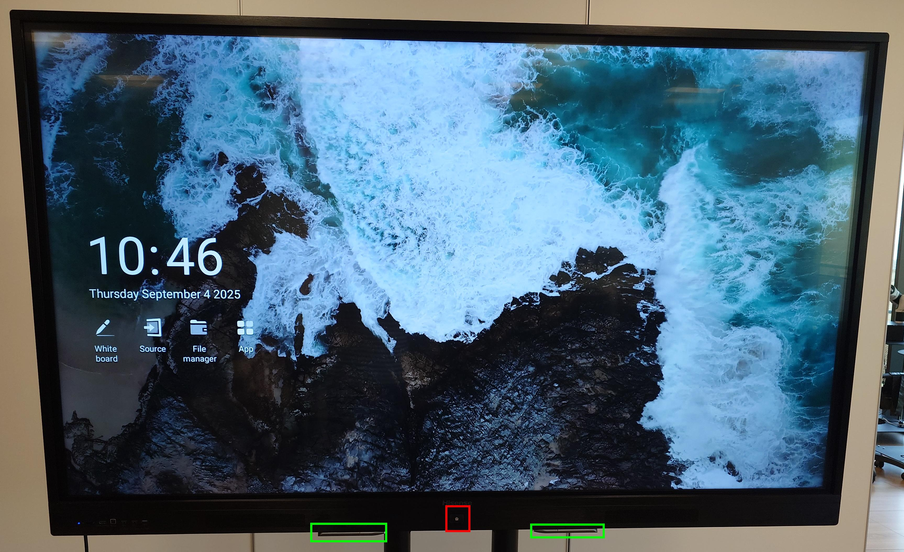

# Aspect fizic al tablei

	

		
	

Pe partea frontala a tablei se disting urmatoarele elemente:
- Creioanele magnetice sunt pozitionate in zona de jos, evidentiate cu marcaj verde in imagine.
- Butonul fizic **Home** este situat central, pe rama, incercuit cu rosu in imagine. Acest buton permite accesul rapid la meniul contextual.

	

		
	

Pe partea laterala stanga a tablei se afla butonul fizic de **Pornire/Oprire**, incadrat cu rosu in imagine. Acesta intrerupe complet alimentarea tablei.

---

# Softul tablei
## Introducere

	

		
	

Ecranul principal afiseaza data si ora, precum si meniul de baza. De aici pot fi accesate aplicatiile principale: Whiteboard, Source, File Manager si App.

## Selectarea sursei HDMI

	

		
	

> Pentru a accesa acest meniu, se apasa butonul fizic **Home** de pe rama tablei.

Prin optiunea **Source** se selecteaza dispozitivul conectat prin HDMI.
- **HDMI-Input1** corespunde portului HDMI din partea din fata a tablei.
- **HDMI-Input2** corespunde portului HDMI din partea laterala a tablei.

Semnalul video selectat va fi afisat imediat pe tabla.

## Adnotarea peste semnalul HDMI

	

		
	

> Pentru a activa adnotarea, se apasa butonul fizic **Home** de pe rama tablei si se selecteaza **Note**.

Este posibila desenarea si scrierea peste continutul redat prin HDMI, fara a afecta imaginea originala.

## Pornirea tablei albe (Whiteboard)

	

		
	

Tabla digitala poate fi pornita direct din meniul principal al tablei, prin selectarea optiunii **Whiteboard**.

> Alternativ, aceeasi optiune poate fi accesata si prin apasarea butonului fizic **Home** de pe rama tablei, urmat de selectarea **WhiteBoard**.

Se deschide o pagina noua pregatita pentru desen si notite.

## Activarea modului de desen

	

		
	

In modul Whiteboard, selectand instrumentul creion, se poate desena liber pe suprafata alba. Este modul standard pentru scriere si schitare.

## Alegerea culorii creionului

	

		
	

Din bara de instrumente de jos se poate alege culoarea dorita pentru creion (negru, alb, rosu, galben, albastru). Culoarea se aplica instant.

## Alegerea grosimii creionului

	

		
	

Bara de instrumente permite schimbarea grosimii liniei. Este utila pentru diferentierea elementelor vizuale.

## Alegerea culorii markerului

	

		
	

Exista si instrumentul marker, cu culori distincte si o linie mai accentuata, potrivita pentru evidentiere.

## Stergerea completa a continutului

	

		
	

Pentru a sterge intreaga pagina, se apasa pe iconita **radiera** din bara de instrumente, apoi se activeaza optiunerea de stergere completa.

> Aceasta optiune nu se activeaza printr-o simpla apasare. Este necesar sa tineti apasat pe butonul tip **slide** si sa il trageti spre dreapta pentru a confirma stergerea completa.

Dupa confirmare, intreaga pagina devine goala si poate fi utilizata din nou.

## Stergerea partiala a continutului

	

		
	

Pentru a sterge doar o parte a continutului, se apasa pe iconita **radiera** din bara de instrumente.
In acest mod, tableta permite stergerea pe zonele trase de utilizator.

> Trebuie tinut apasat si tras cu degetul sau stylus-ul pe zona dorita pentru a sterge selectiv liniile sau desenele.

## Adaugarea unei noi pagini

	

		
	

Prin apasarea butonului **+**, se adauga o pagina noua in cadrul sesiunii curente.

## Schimbarea paginii afisate

	

		
	

Navigarea intre pagini se face folosind bara de jos sau miniaturile din partea dreapta. Indicatorul (ex. "3/3") arata pagina curenta.

## Stergerea unei pagini

	

		
	

O pagina poate fi stearsa prin apasarea simbolului **X** din coltul miniaturii corespunzatoare.

## Salvarea continutului ca PDF

	

		
	

La final, tot continutul creat in sesiune poate fi exportat intr-un fisier PDF, pentru arhivare sau distribuire.

## Revenirea la meniul principal

	

		
	

> Pentru a reveni la meniul principal, se apasa butonul fizic **Home** de pe rama tablei si se selecteaza **Back**.

Utilizatorul este readus la ecranul principal, unde pot fi accesate alte aplicatii sau surse.
