# Aspectul fizic al tablei

	

		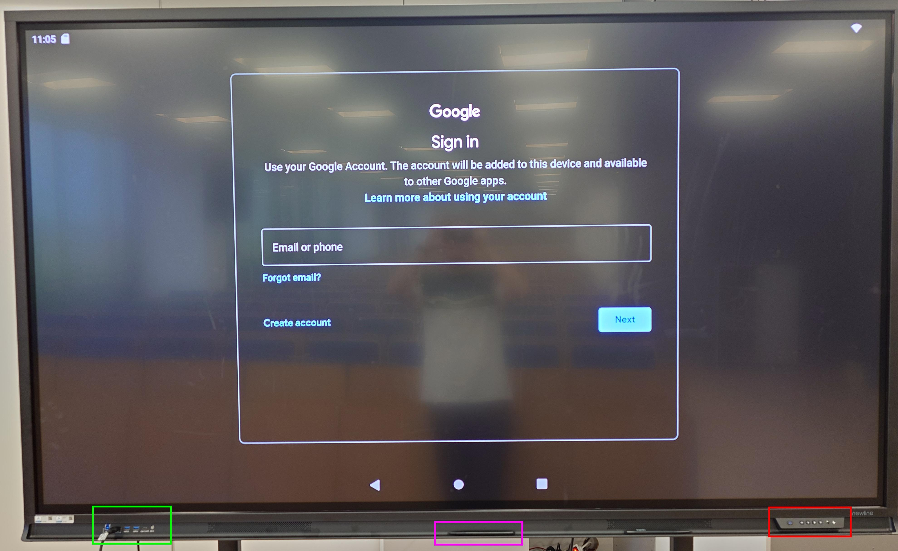
	

<!--The front of the smart board presents itself with the **USB ports** on the left side (highlighted in green), the **physical buttons** on the right side (highlighted in red) and the stylus in the middle (highlighted in pink).-->

Partea frontala a tablei inteligente se prezinta cu **porturile USB** pe partea stanga (evidentiate in verde), **butoanele fizice** pe partea dreapta (evidentiate in rosu) si stylusul in mijloc (evidentiat in roz).

	

		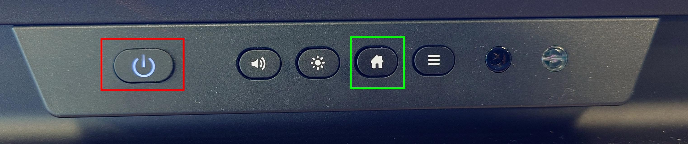
	

<!--You can find the **power button** on the right side, as you can see in the picture above. The **power button** is highlighted in red, and is used for waking up the smart board. If it is not blue or red, it means the board is not receiving electrical power. 

The **home button**, highlighted in green, can be used to return to the main menu. -->

Puteti gasi **butonul de alimentare** in partea dreapta, dupa cum puteti vedea in imaginea de mai sus. **Butonul de alimentare** este evidentiat in rosu si este utilizat pentru a porni tabla inteligenta. Daca nu este albastru sau rosu, inseamna ca tabla nu primeste curent.

Butonul **home**, evidentiat in verde, poate fi utilizat pentru a reveni la meniul principal. 

	

		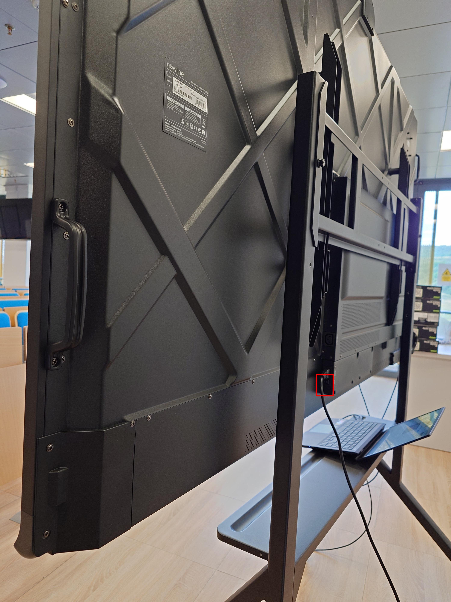
	

<!--The physical power switch of the board is located on the back side, and is viewable from the righthand side of the table. It is normally in the `I` position when operational. 

> If the smart board is not receiving power (indicated by the **power button** in the front), check for this physical switch, or it's connection to the power socket. -->

Comutatorul fizic de alimentare este situat pe partea din spate si este vizibil din partea dreapta a tablei. Acesta este in mod normal in pozitia "I" atunci cand este operational. 

> Daca tabla inteligenta nu primeste curent (indicat de **butonul de alimentare** din fata), verificati acest comutator fizic sau conexiunea acestuia la priza de alimentare. 

	

		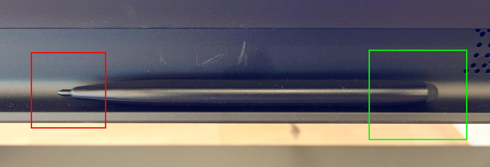
	

<!--The **stylus** can be used as an alternative to drawing on the board with your finger. 

> Please note that this **stylus** has two ends - A thin one, and a thicker one. They serve very distinct purposes when using the whiteboard for drawing. -->

**Stylus**-ul poate fi folosit ca alternativa la desenarea pe tabla cu degetul. 

> Va rugam sa retineti ca acest **stylus** are doua capete - Unul subtire si unul mai gros. Acestea servesc unor scopuri foarte distincte atunci cand folositi tabla pentru desenat. 

---

# Softul tablei

## Introducere

	

		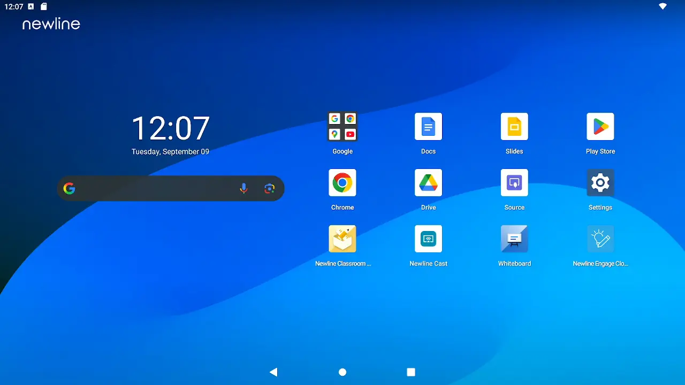
	

The main menu of the smart board resembles an Android Tablet. It is not animated and is the default idle status for this type of smart board. 

## Selectarea sursei HDMI

	

		
	

<!--Switching the board into displaying a **HDMI** image should be done automatically. If it is not, you can change the input source from the main menu.

> You can also reach the main menu by pressing on the physical **Home** button.

From there, press on the `Source` icon, and a new menu will be presented to you. From this menu, select your desired **HDMI** input. 

> **Attention:** On this board model, all **HDMI** inputs are located on the left side of the board, on the backside. A cable should be plugged into slot `HDMI 1`. If it is not, please move it to the correct slot.-->

Comutarea tablei in afisarea unei imagini **HDMI** ar trebui sa se faca automat. Daca acest lucru nu se intampla, puteti schimba sursa de intrare din meniul principal.

> De asemenea, puteti ajunge la meniul principal apasand pe butonul fizic **Home**.

De acolo, apasati pe pictograma `Source` si vi se va prezenta un nou meniu. Din acest meniu, selectati intrarea **HDMI** dorita. 

> **Atentie:** Pe acest model de placa, toate intrarile **HDMI** sunt situate pe partea stanga a placii, pe partea din spate. In slotul `HDMI 1` ar trebui sa fie conectat un cablu. Daca nu este, va rugam sa il mutati in slotul corect.

## Adnotarea peste semnalul HDMI

> Aceasta functie nu este acceptata de aceasta tabla inteligenta.

## Pornirea tablei albe (Whiteboard)

	

		
	

<!--To start the Whiteboard application, navigate to the main menu and press on the `Whiteboard` icon.-->

Pentru a porni aplicatia Whiteboard, navigati la meniul principal si apasati pe pictograma `Whiteboard`. Tabla alba este disponibila din meniul principal. Aceasta permite desenarea, salvarea si gestionarea simultana a mai multor sesiuni de scriere pe tabla. 

## Alegerea culorii creionului

	

		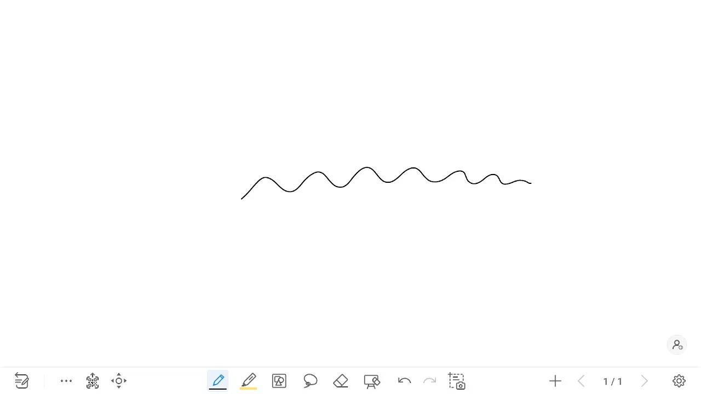
	

Culoarea instrumentului `Creion` poate fi selectata dintr-o paleta de culori incorporata. Este posibila si adaugarea de culori personalizate, dar acest lucru nu este abordat in acest ghid.

La apasarea pictogramei `Creion` din panoul de instrumente din partea de jos, se afiseaza un meniu. Dupa selectarea culorii dorite, instrumentul va desena respectand alegerea dvs. 

> **Atentie:** Varful subtire al stylusului scrie intotdeauna negru, pe cand cel gros respecta culorile alese din acest meniu.

## Alegerea grosimii creionului

	

		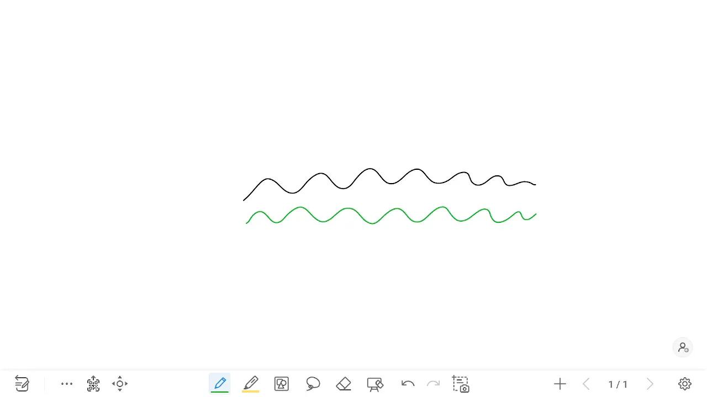
	

Grosimea de desen a instrumentului `Creion` poate fi ajustata din panoul de instrumente din partea de jos, apasand pe pictograma `Creion`. Dupa afisarea meniului, selectati grosimea preferata din selectia disponibila sub paleta de culori.

## Alegerea culorii markerului

	

		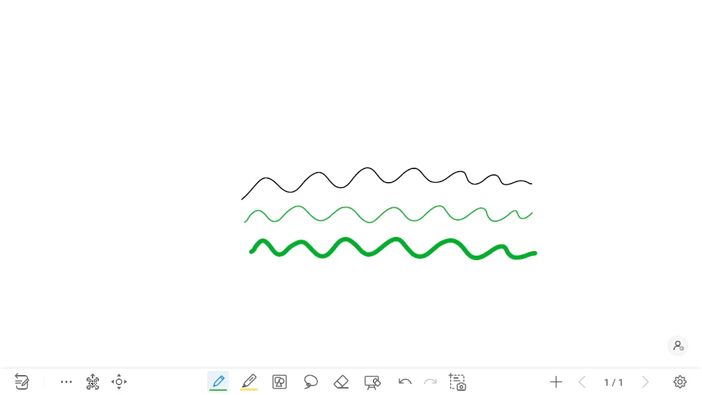
	

> Va rugam sa aveti in vedere faptul ca instrumentul **Marker** nu este destinat scrierii si desenarii, ci evidentierii. Daca doriti sa scrieti pe tabla, utilizati instrumentul **Creion**. 

Culoarea instrumentului marker poate fi reglata dintr-o paleta fixa de sase culori, apasand pe pictograma `Marker` din panoul de instrumente din partea de jos. Alegeti culoarea dorita din meniul care se deschide. 

## Alegerea grosimii markerului

	

		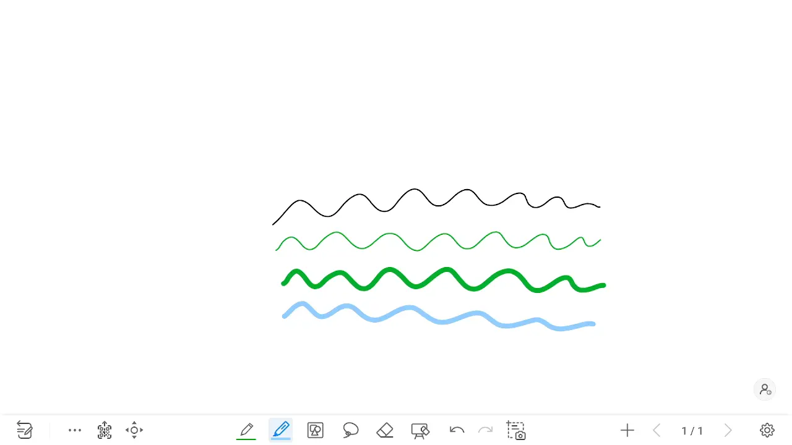
	

Grosimea de desen a instrumentului `Marker` poate fi ajustata din panoul de instrumente din partea de jos, apasand pe pictograma `Marker`. Dupa afisarea meniului, selectati grosimea preferata din selectia disponibila sub paleta de culori.

## Stergerea completa a continutului

	

		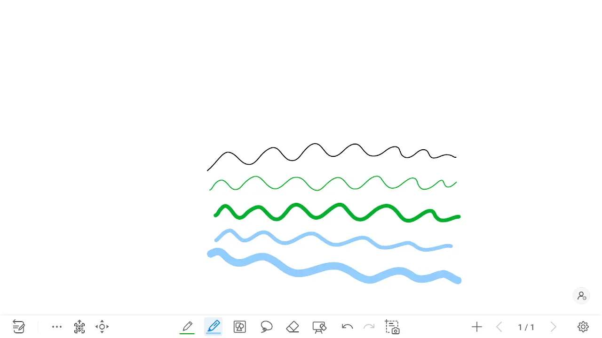
	

<!--Erasing the whole white board can be done from the bottom instrument panel. Select the icon depicting an eraser with a white board in the background to initiate the process. Explicit confirmation is required to actually erase the board. On the menu that shows up, select the `Clear` button to confirm your intent.-->

Stergerea intregii table albe se poate face din panoul de instrumente din partea de jos. Selectati pictograma care reprezinta o radiera cu o tabla alba in fundal pentru a initia procesul. Este necesara confirmarea explicita pentru a sterge efectiv tabla. 

In meniul care apare, selectati butonul `Clear` pentru a va confirma intentia.

## Stergerea partiala a continutului

	

		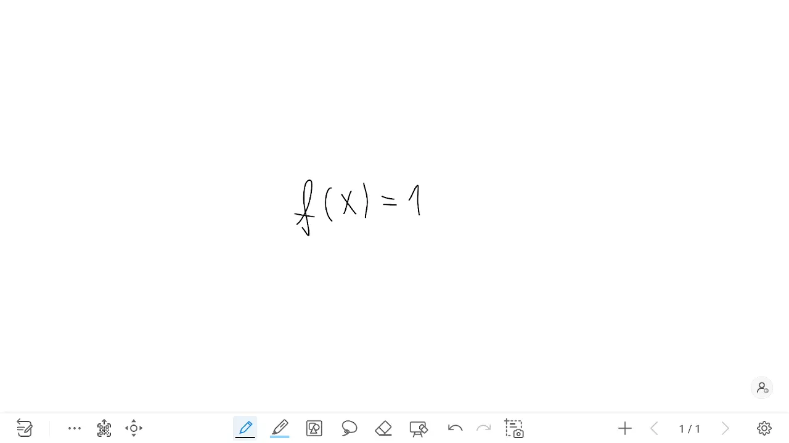
	

<!--
Erasing the whole white board can be done from the bottom instrument panel. Select the icon depicting an eraser (located to the left of the `Clear Board` icon). 

From the menu that opens, select the first icon. Now your finger (or the thicker part of the stylus) acts like an eraser and you can erase just like with a normal eraser. 

The second icon from the menu deletes contiguous lines, that is, whole letters, numbers and shapes at once. -->

Stergerea intregii planse albe se poate face din panoul de instrumente inferior. Selectati pictograma care reprezinta o radiera (situata in stanga pictogramei `Clear Board`). 

Din meniul care se deschide, selectati prima pictograma. Acum degetul dumneavoastra (sau partea mai groasa a stylusului) actioneaza ca o guma de sters si puteti sterge la fel ca si un burete normal.

A doua pictograma din meniu sterge linii contigue, adica litere intregi, numere si forme deodata.

Translated with DeepL.com (free version)

## Adaugare pagina noua

	

		
	

<!--Adding a new page allows you to move a to a blank screen while keeping your previous writing available and returned to at a later point in time. In order to add a new page, use the `+` symbol located in the buttom right corner of the whiteboard screen.

Upon pressing, a new page will immediately show up blank, and a confirmation menu will display, indicating the page you are currently on.

You may note that the page indicator situated to the left of the `+` symbol has now increased, placing you to the last available page (the one you just created). -->

Adaugarea unei pagini noi va permite sa treceti la un ecran alb, pastrand in acelasi timp scrisul anterior disponibil pentru a putea reveni la el ulterior. Pentru a adauga o pagina noua, apasati simbolul `+` situat in coltul din dreapta jos al ecranului.

La apasarea butonului, va aparea imediat o pagina noua goala, fara confirmare suplimentara.

Puteti observa ca indicatorul de pagina situat in stanga simbolului `+` a crescut dupa adaugarea noii pagini, plasandu-va la ultima pagina disponibila, cea pe care tocmai ati creat-o.

## Schimbarea paginii afisate

	

		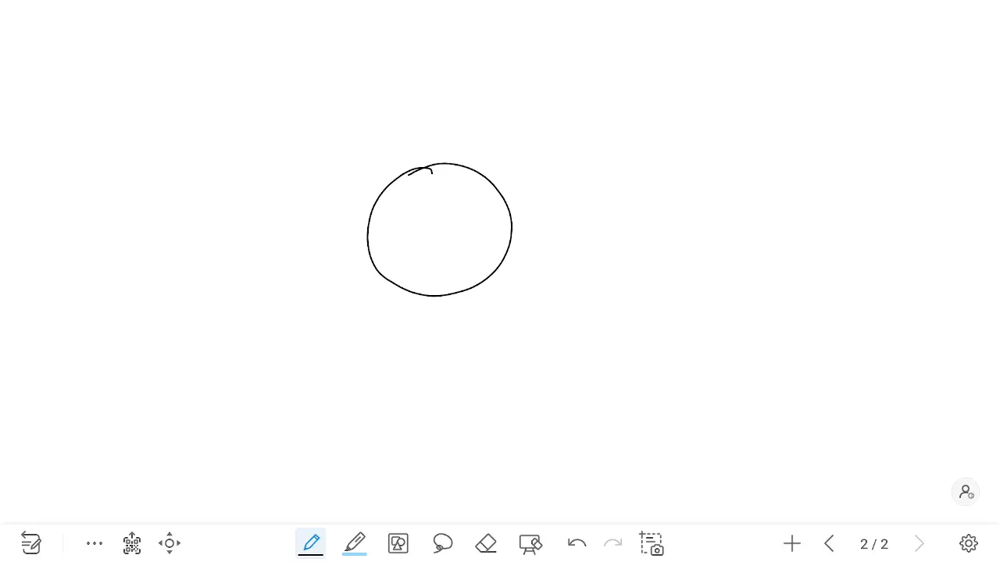
	

<!-- Changing the displayed page can be achieved by pressing on the text displaying the page count (for example, `3/3`), situated to the left of the `+` button used for adding new pages. 

Upon pressing, a new menu is displayed showing the available pages. These can be scrolled through using your finger or the stylus. In order to change the active page, select it from the menu.

After changing the page, press anywhere else to close the menu. -->

Schimbarea paginii afisate se poate realiza apasand pe textul care afiseaza numarul de pagini (de exemplu, `3/3`), situat in dreapta butonului `+` utilizat pentru adaugarea de noi pagini. 

La apasare, este afisat un nou meniu care prezinta paginile disponibile. Pentru a schimba pagina activa, selectati-o din meniu.

Dupa schimbarea paginii, apasati pe butonul `X` din partea din dreapta sus a meniului pentru a-l inchide.

## Stergerea unei pagini

	

		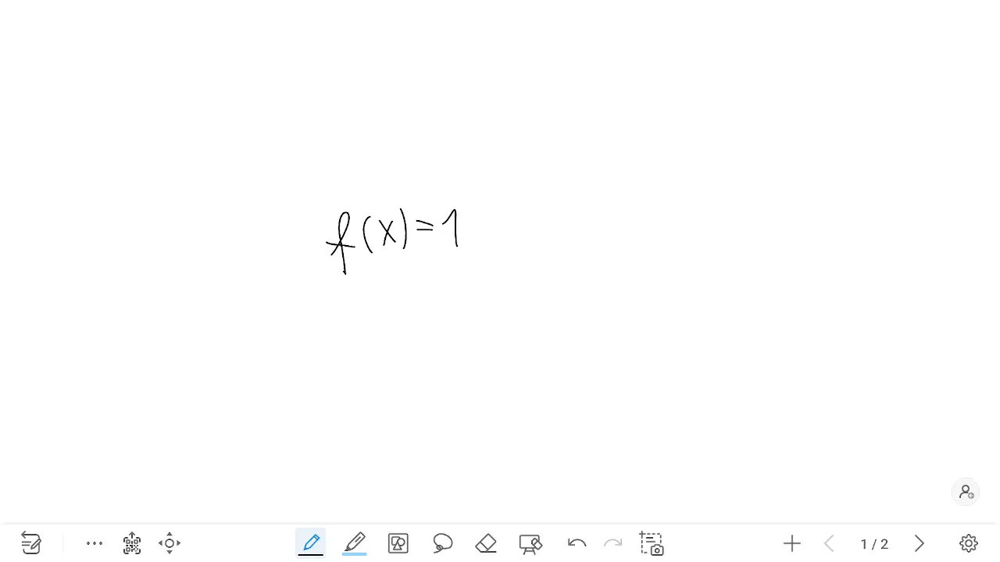
	

<!--Page deletion is achieved from the same menu that is used to change the pages. Upon pressing the text that shows the number of pages (for example, `3/3`), the available pages are shown.

The default mode for this menu is page selection. If you want to delete pages, you can either press on the `Select` button from the bottom right of the menu, or press and hold on any of the thumbnails.

After entering this mode, press the `X` symbol of any page, and confirm your intent in the dialog that pops up on the screen.-->

Stergerea paginilor se realizeaza din acelasi meniu care este utilizat pentru schimbarea paginilor. La apasarea textului care arata numarul de pagini (de exemplu, `3/3`), sunt afisate paginile disponibile.

Modul implicit pentru acest meniu este selectarea paginilor. Daca doriti sa stergeti pagini, tineti apasat pe oricare dintre miniaturi.

> Puteti si sa apasati pe butonul `Select` din dreapta jos a meniului pentru a intra in modul de stergere / selectie.

Dupa ce ati intrat in acest mod, apasati simbolul `X` al oricarei pagini si confirmati-va intentia in dialogul care apare pe ecran.

## Salvarea continutului ca PDF

	

		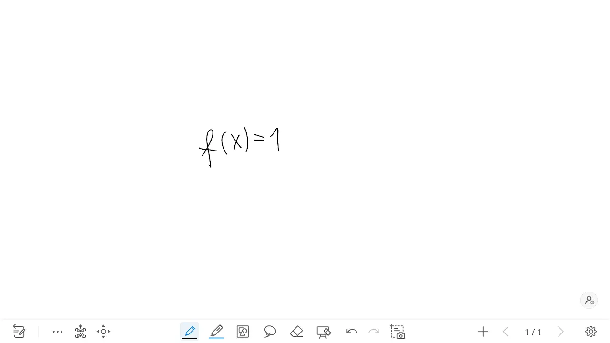
	

<!-- > **Attention:** Saving to a USB device might require formatting it with a FAT32 filesystem. Official tests were executed using a FAT32 device. If yours uses a different format, your mileage may vary.

It is possible to save all your boards on a `USB stick`, in a PDF format. In the resulting file, each page from the board corresponds to a page in the document.

Insert your USB device into one of the available slots on the front side of the board, in the bottom left corner. If it is successfuly recognized, a menu will show up mentioning `New storage device access`. Ignore this prompt for now.

Press on the three dots on the bottom left of the whiteboard. Choose the `File` menu, and then `Export to Local`. From the menu that shows up, adjust the format of the document as `PDF`, instead of the default choice. After this, press `Export`.

The menu that shows is different from what you've seen previosuly. In the upper left corner, press the `Menu` icon (three lines stacked on top of eachother), and choose your `USB stick`. Then, from the bottom of the board, press `Use this folder`, followed by `Allow` in the confirmation menu.

After this, a notification will appear indicated that saving was successful.-->

> **Atentie:** Salvarea pe un dispozitiv USB poate necesita formatarea acestuia cu un sistem de fisiere FAT32. Testele oficiale au fost efectuate utilizand un dispozitiv FAT32. Daca al dumneavoastra utilizeaza un format diferit, rezultatul poate varia.

Este posibila salvarea tuturor desenelor pe un `USB stick`, in format PDF. In fisierul rezultat, fiecare pagina din tabla corespunde unei pagini din document.

Introduceti dispozitivul USB in unul dintre sloturile disponibile pe partea frontala a tablei, in coltul din stanga jos. Daca acesta este recunoscut cu succes, va aparea un meniu cu mentiunea `New storage device access`. Ignorati acest mesaj pentru moment.

Apasati pe cele trei puncte din stanga jos a whiteboard-ului. Alegeti meniul `File`, apoi `Export to Local`. Din meniul care apare, ajustati formatul documentului ca fiind `PDF`, in loc de alegerea implicita. Dupa aceasta, apasati `Export`.

Meniul care apare este diferit de cele pe care le-ati vazut anterior. In coltul din stanga sus, apasati pictograma `Menu` (trei linii suprapuse), si alegeti stick-ul USB. Apoi, din partea de jos a panoului, apasati `Use this folder`, urmat de `Allow` in meniul de confirmare.

Dupa aceasta, va aparea o notificare care va indica faptul ca salvarea a fost efectuata cu succes.

## Revenirea la meniul principal

	

		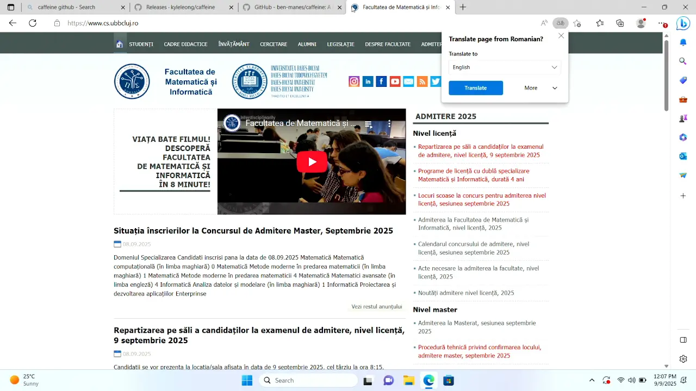
	

<!-- > This action can also be achieved by pressing on the physical **Home** button from the button panel. 

Going back to the main menu can be achieved by sliding your finger up from the bottom of the board. Once you do this, the navigation menu will be displayed and you can press on the `Circle` to go back to the main menu.-->

> Aceasta actiune poate fi realizata si prin apasarea butonului fizic **Home** din panoul de butoane. 

Revenirea la meniul principal poate fi realizata prin glisarea degetului in sus din partea de jos a panoului. Odata ce ati facut acest lucru, va fi afisat meniul de navigare si puteti apasa pe `butonul cerculet` pentru a reveni la meniul principal.

