# Aspectul fizic al tablei

	

		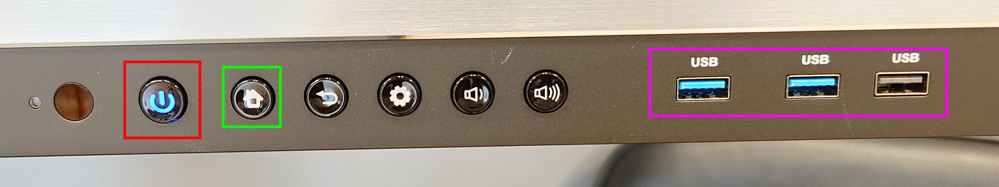
	

<!--On the front side of the smart whiteboard you can see both the **physical buttons**, as well as the **USB ports** (highlighted in pink). 

The physical **home button** is highlighted in green. This button may be used to return to the home menu at any time.
The **power button** is highlighted in red, and is used for waking up the smart whiteboard. If it is not blue or red, it means the whiteboard is not receiving power.-->

Pe partea din fata a tablei inteligente puteti vedea atat **butoanele fizice**, cat si **porturile USB** (evidentiate in roz). 

Butonul fizic **home** este evidentiat in verde. Acest buton poate fi utilizat in orice moment pentru a reveni la meniul de pornire.
**Botonul de alimentare** este evidentiat in rosu si este utilizat pentru a trezi tabla inteligenta. Daca nu este albastru sau rosu, inseamna ca whiteboard-ul nu primeste energie.

	

		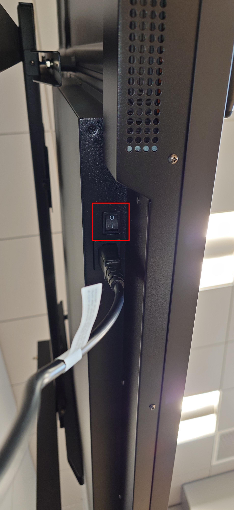
	

<!--The physical power switch of the board is located on the bottom side, and is viewable from the underside of the table. It is normally in the `I` position when operational. 

> If the smart board is not receiving power (indicated by the **power button** in the front), check for this physical switch, or it's connection to the power socket. -->

Comutatorul fizic de alimentare al tablei este situat pe partea inferioara si este vizibil din partea inferioara a tablei. Acesta este in mod normal in pozitia "I" atunci cand este operational. 

> Daca tabla inteligenta nu primeste curent (indicat de **butonul de alimentare** din fata), verificati acest intrerupator fizic sau conexiunea acestuia la priza de alimentare. 

	

		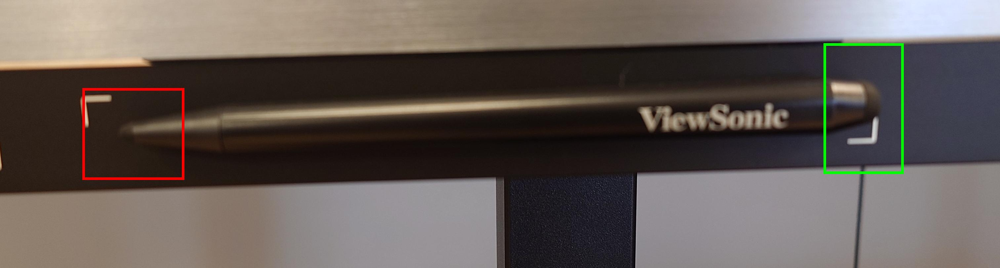
	

<!--The **stylus** can be used as an alternative to drawing on the board with your finger. 

> Please note that this **stylus** has two ends - A thin one, and a thicker one. They serve very distinct purposes when using the whiteboard for drawing.-->

**Stylusul** poate fi folosit ca alternativa la desenarea pe tabla cu degetul. 

> Va rugam sa retineti ca acest **stylus** are doua capete - Unul subtire si unul mai gros. Acestea servesc unor scopuri foarte distincte atunci cand folositi tabla pentru desenat.

---

# Softul tablei
## Introducere

	

		
	

<!--The main menu displays few items, but is the center point of switching between whiteboard mode and HDMI mode.-->

Meniul principal afiseaza putine elemente, dar este punctul central al comutarii intre modul Whiteboard si modul HDMI.

## Selectarea sursei HDMI

	

		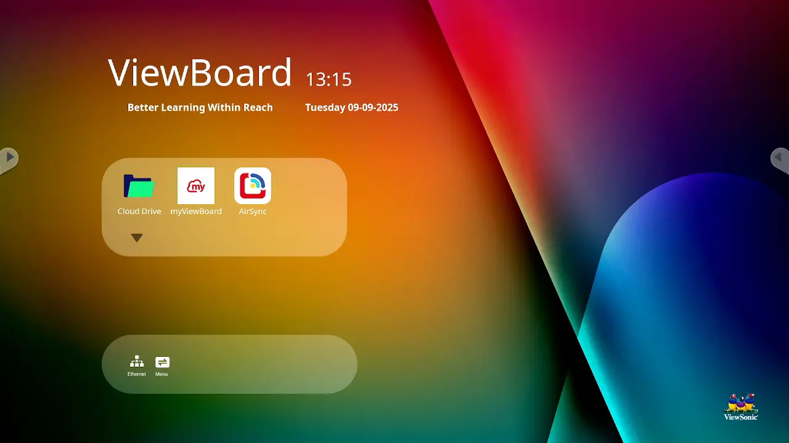
	

<!--Selecting the **HDMI** mode is done from the main menu, from the `Menu` icon depicted in the bottom row of icons. Pressing this icon will open a new menu from where you can select your desired input source.

Simply press on your desired input, and wait for the loading icon to complete. Once complete, the smartboard should switch in **HDMI** mode, and you'll be able to see your projection on the board. -->

Selectarea modului **HDMI** se face din meniul principal, de la pictograma `Menu` reprezentata in randul inferior de pictograme. Apasand aceasta pictograma se va deschide un nou meniu din care puteti selecta sursa de intrare dorita.

Pur si simplu apasati pe intrarea dorita si asteptati ca pictograma de incarcare sa se finalizeze. Odata finalizata, tabla inteligenta ar trebui sa treaca in modul **HDMI** si veti putea vedea proiectia pe tabla. 

> **Atentie:** Pe acest model de placa, toate intrarile **HDMI** sunt situate pe partea dreapta a tablei, pe partea din spate. In slotul `HDMI 1` ar trebui sa fie conectat un cablu. Daca nu este, va rugam sa il mutati in slotul corect.

## Adnotarea peste semnalul HDMI

	

		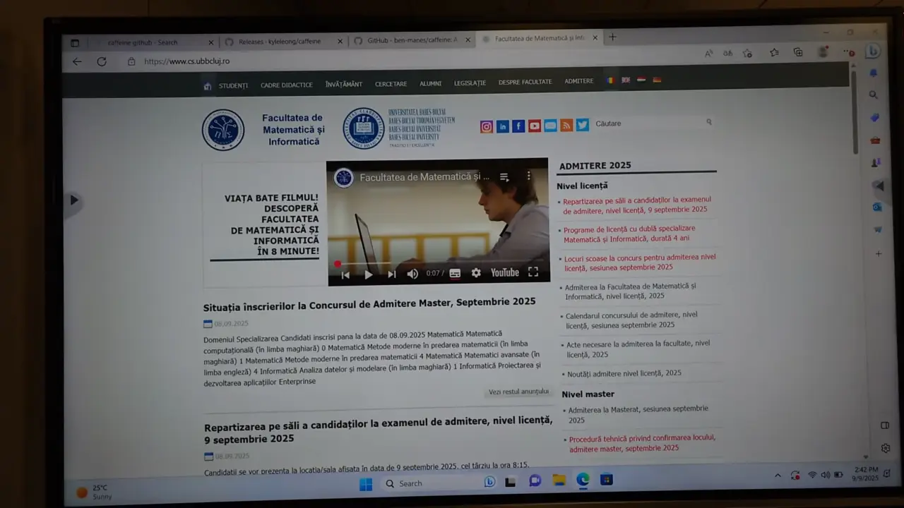
	

<!--It is possible freeze the image displayed via **HDMI** and draw on top of it. Once the projection is live, a menu should show on either side of the board, indicated by an arrow pointing towards the inside of the screen. 

Press on this arrow to open the contextual menu for live input. From there, you may select the `Pencil` icon, and wait for a snapshot of the screen to be taken. 

> You may need to wait a few seconds for the drawing mode to be activated. You will know when this happens, as another menu will be displayed on top of the picture.

Once the menu is visible, you should be in drawing mode. Proceed to adnotate your screen using the stylus or your finger.

You may exit this mode by using the `X` situated at the bottom of the newly opened menu.

> **Attention:** The image displayed from **HDMI** will be frozen as long as the snapshot is active and displayed. You must close this mode to continue the live video feed. -->

Este posibil sa inghetati imaginea afisata prin **HDMI** si sa desenati deasupra acesteia. Odata ce proiectia este activa, ar trebui sa apara un meniu pe fiecare parte a ecranului, indicat de o sageata indreptata spre interiorul ecranului. 

Apasati pe aceasta sageata pentru a deschide meniul contextual pentru proiectia live. De acolo, puteti selecta pictograma `Creion` si asteptati sa fie facuta o fotografie a ecranului. 

> Este posibil sa fie nevoie sa asteptati cateva secunde pentru ca modul de desen sa fie activat. Veti sti cand se intampla acest lucru, deoarece un alt meniu va fi afisat deasupra imaginii.

Odata ce meniul este vizibil, ar trebui sa fiti in modul de desenare. In continuare, adnotati ecranul utilizand stylusul sau degetul.

Puteti iesi din acest mod utilizand butonul `X` situat in partea de jos a meniului nou deschis.

> **Atentie:** Imaginea afisata de la **HDMI** va fi inghetata atat timp cat instantaneul este activ si afisat. Trebuie sa inchideti acest mod pentru a continua prezentarea.

## Pornirea tablei albe (Whiteboard)

	

		
	

<!--The whiteboard is available from the main menu. It allows drawing, saving and managing multiple board sessions simultanously.

Pentru a porni aplicatia Whiteboard, navigati la meniul principal si apasati pe pictograma `Whiteboard`. Tabla alba este disponibila din meniul principal. Aceasta permite desenarea, salvarea si gestionarea simultana a mai multor sesiuni de scriere pe tabla. -->

Tabla alba este disponibila din meniul principal. Aceasta permite desenarea, salvarea si gestionarea simultana a mai multor sesiuni de tabla.

Pentru a porni aplicatia Whiteboard, navigati la meniul principal si apasati pe pictograma `Whiteboard`. Tabla alba este disponibila din meniul principal. Aceasta permite desenarea, salvarea si gestionarea simultana a mai multor sesiuni de scriere pe tabla. 

## Alegerea culorii creionului

	

		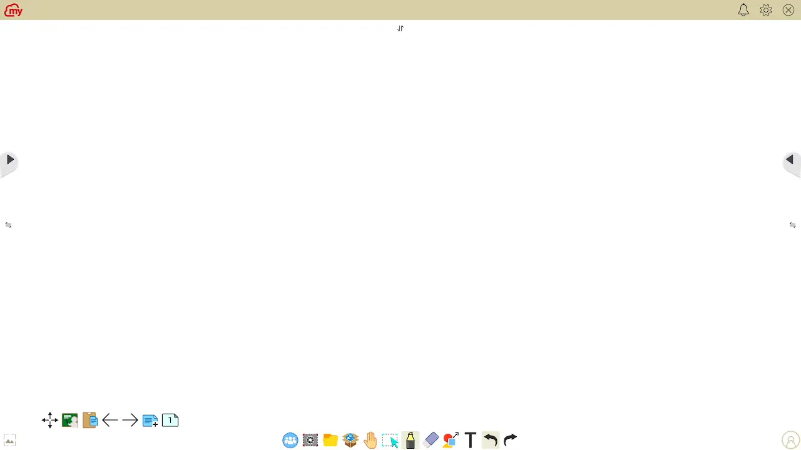
	

<!-- > You can draw in this mode without selecting it by using the fine tip of the stylus

The pencil has multiple available colors. If you want to change it's color, open it's menu by pressing on the `pencil`/`marker` icon that is available in the bottom instrument panel.

From the newly opened menu, make sure you are editing the settings of the `pencil`. You can ensure this by choosing the leftmost drawing tool from this menu. 

> This version of whiteboard names the `pencil` as being a `marker`

Choose your desired color from the available pallete. You may preview your choice in the circle to the left of the sliders below the color pallete.

You may then close the menu by pressing on the `X` icon in the upper right corner of this menu, or by simply pressing somewhere else.-->

> Puteti desena in acest mod fara a-l selecta folosind varful fin al stylusului

Creionul are mai multe culori disponibile. Daca doriti sa ii schimbati culoarea, deschideti meniul acestuia apasand pe pictograma `creion`/`marker` care este disponibila in partea de jos a panoului de instrumente.

Din meniul nou deschis, asigurati-va ca editati setarile `creionului`. Va puteti asigura de acest lucru alegand cel mai din stanga instrument de desen din acest meniu. 

> Aceasta versiune a tablei albe numeste `creion` ca fiind un `marker`

Alegeti culoarea dorita din paleta disponibila. Puteti previzualiza alegerea facuta in cercul din stanga glisoarelor de sub paleta de culori.

Puteti apoi inchide meniul apasand pe pictograma `X` din coltul din dreapta sus al acestui meniu, sau pur si simplu apasand in alta parte.

## Alegerea grosimii creionului

	

		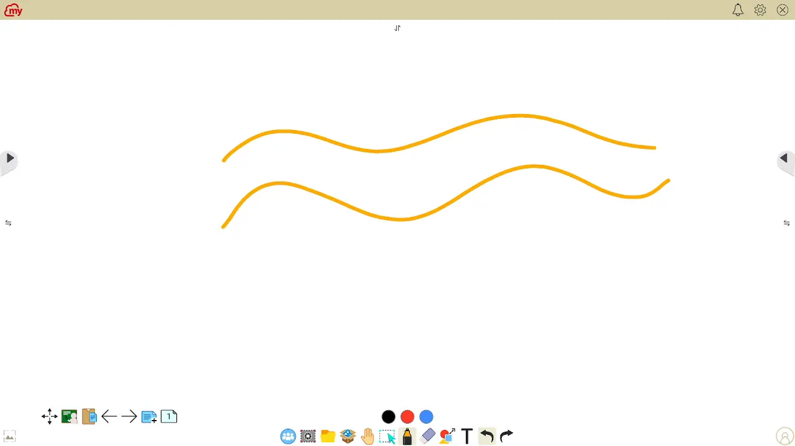
	

<!--The pencil has multiple available thicknesses. If you want to change it's thickness, open it's menu by pressing on the `pencil`/`marker` icon that is available in the bottom instrument panel.

From the newly opened menu, make sure you are editing the settings of the `pencil`. You can ensure this by choosing the leftmost drawing tool from this menu. 

> This version of whiteboard names the `pencil` as being a `marker`

Choose your desired thickness by adjusting the top slider, as depicted in the picture. You may preview your choice in the circle to the left of the thickness sliders.

You may then close the menu by pressing on the `X` icon in the upper right corner of this menu, or by simply pressing somewhere else.-->

Creionul are mai multe grosimi disponibile. Daca doriti sa ii modificati grosimea, deschideti meniul acestuia apasand pe pictograma `creion`/`marker` care este disponibila in panoul de instrumente inferior.

Din meniul nou deschis, asigurati-va ca editati setarile `creionului`. Va puteti asigura de acest lucru alegand cel mai din stanga instrument de desen din acest meniu. 

> Aceasta versiune a tablei albe numeste `creion` ca fiind un `marker`

Alegeti grosimea dorita ajustand cursorul de sus, asa cum se vede in imagine. Puteti previzualiza alegerea facuta in cercul din stanga glisoarelor de grosime.

Puteti apoi inchide meniul apasand pe pictograma `X` din coltul din dreapta sus al acestui meniu, sau pur si simplu apasand in alta parte.

## Alegerea culorii markerului

	

		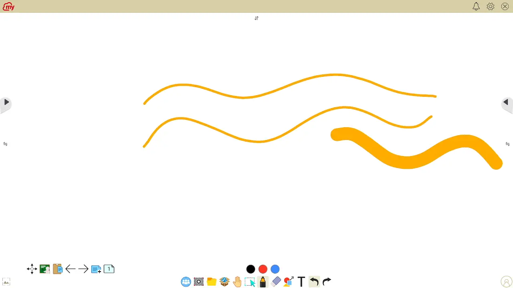
	

<!-- > You can draw in this mode without selecting it by using the thick tip of the stylus

The pencil has multiple available colors. If you want to change it's color, open it's menu by pressing on the `pencil`/`marker` icon that is available in the bottom instrument panel.

From the newly opened menu, make sure you are editing the settings of the `marker`. You can ensure this by choosing the leftmost drawing tool from this menu. 

> This version of whiteboard names the `marker` as being a `highlighter`

Choose your desired color from the available pallete. You may preview your choice in the circle to the left of the sliders below the color pallete.

You may then close the menu by pressing on the `X` icon in the upper right corner of this menu, or by simply pressing somewhere else.

> The `highlighter` is not inteded for drawing purposes, but rather for highlighting. If you want to draw on the board, focus on using the `marker` mode. -->

> Puteti desena in acest mod fara a-l selecta folosind varful gros al stylusului

Creionul are mai multe culori disponibile. Daca doriti sa ii schimbati culoarea, deschideti meniul acestuia apasand pe pictograma `creion`/`marker` care este disponibila in panoul de instrumente inferior.

Din meniul nou deschis, asigurati-va ca editati setarile `markerului`. Va puteti asigura de acest lucru alegand al doilea instrument de desen din stanga din acest meniu. 

> Aceasta versiune a tablei albe numeste `marker` ca fiind un `highlighter`

Alegeti culoarea dorita din paleta disponibila. Puteti previzualiza alegerea facuta in cercul din stanga glisoarelor de sub paleta de culori.

Puteti apoi inchide meniul apasand pe pictograma `X` din coltul din dreapta sus al acestui meniu, sau pur si simplu apasand in alta parte.

> `Highlighterul` nu este destinat pentru desen, ci mai degraba pentru evidentiere. Daca doriti sa desenati pe tabla, concentrati-va pe utilizarea modului `creion`/`marker`

## Stergerea completa a continutului

	

		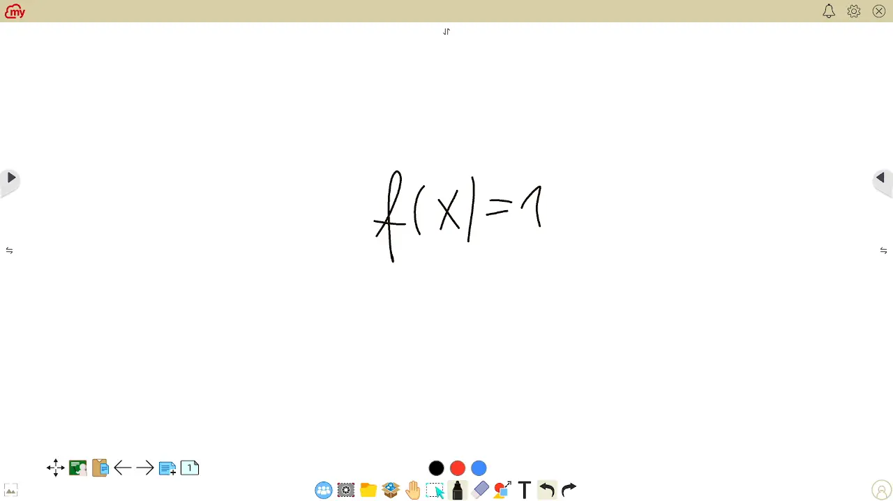
	

<!--You may erase the board by using the `eraser` available in the bottom instrument panel. Upon pressing this icon, you will be presented with a menu with multiple choices.

If you intend to completely erase the board, press the last icon to the right, the one depicting a `trash bin`. 

After this, the board will be completely wiped.

> If you have multiple pages, this action will only erase the contents of the currently active one-->

Puteti sterge tabla utilizand `radiera` disponibila in panoul de instrumente de jos. La apasarea acestei pictograme, vi se va prezenta un meniu cu mai multe optiuni.

Daca intentionati sa stergeti complet tabla, apasati ultima pictograma din dreapta, cea care reprezinta un `cos de gunoi`. 

Dupa aceasta, tabla va fi complet stearsa.

> Daca aveti mai multe pagini, aceasta actiune va sterge doar continutul celei active in prezent

## Stergerea partiala a continutului

	

		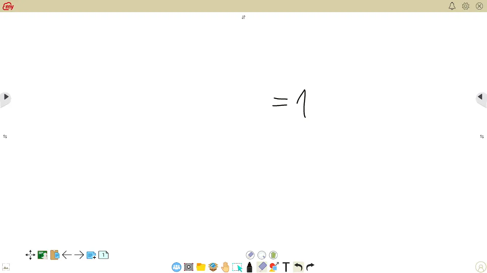
	

<!--Select erasing can be achieved by selecting the `eraser` icon from the bottom instrument panel. From the available menu items, choose the middle icon. 

Then, using your finger or the stylus, circle the area you want to erase, as indicated in the picture.-->

Stergerea selectiva poate fi realizata prin selectarea pictogramei `radiera` din panoul de instrumente inferior. Din elementele de meniu disponibile, selectati pictograma din mijloc. 

Apoi, folosind degetul sau stylusul, incercuiti zona pe care doriti sa o stergeti, asa cum este indicat in imagine.

## Stergere clasica

	

		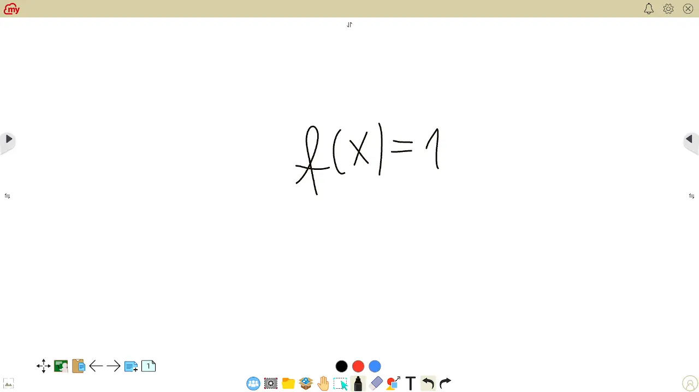
	

<!--Partial erasing can be achieved by selecting the `eraser` icon from the bottom instrument panel. From the available menu items, choose the leftmost icon. 

Then, using your finger or the stylus, draw, using your finger or the stylus, on top of what you want to delete.-->

Stergerea partiala poate fi realizata prin selectarea pictogramei `radiera` din panoul de instrumente inferior. Din elementele de meniu disponibile, selectati pictograma cea mai din stanga. 

Apoi, folosind degetul sau stylusul, desenati, folosind degetul sau stylusul, deasupra a ceea ce doriti sa stergeti.

## Adaugarea unei noi pagini

	

		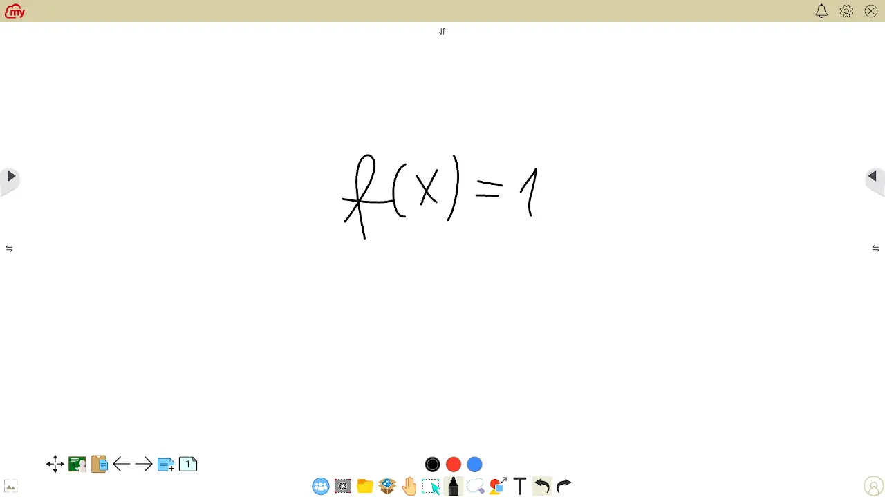
	

<!--Adding a new page allows you to move a to a blank screen while keeping your previous writing available and returned to at a later point in time. In order to add a new page, use the `+` symbol located in the buttom left corner of the whiteboard screen. It is the second icon from the right of the bottom-left button panel.

Upon pressing, a new page will immediately show up blank, and the page icon, available to the right of the `+` icon will increase it's count.-->

Adaugarea unei pagini noi va permite sa treceti la un ecran alb, pastrand in acelasi timp la dispozitie scrisul anterior, la care puteti reveni ulterior. Pentru a adauga o pagina noua, utilizati simbolul `+` situat in coltul din stanga jos al ecranului tablei albe. Este a doua pictograma din dreapta panoului de butoane din stanga jos.

La apasare, o noua pagina va aparea imediat goala, iar pictograma de pagina, disponibila in dreapta pictogramei `+`, isi va creste numarul.

## Schimbarea paginii afisate

	

		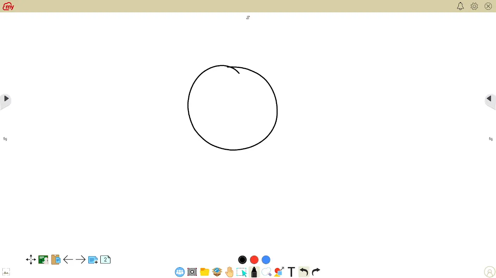
	

<!--Changing the displayed page can be achieved by pressing on the icon displaying the page count (for example, `3`), situated to the right of the `+` button used for adding new pages. 

Upon pressing, a new menu is displayed showing the available pages. These can be scrolled through using your finger or the stylus. In order to change the active page, select it from the menu.

After changing the page, press on the top right `X` icon from the available menu. You may also close this menu by pressing elsewhere on the screen.-->

Schimbarea paginii afisate se poate realiza prin apasarea pe pictograma care afiseaza numarul de pagini (de exemplu, `3`), situata in dreapta butonului `+` utilizat pentru adaugarea de noi pagini. 

La apasare, este afisat un nou meniu care prezinta paginile disponibile. Acestea pot fi parcurse folosind degetul sau stylusul. Pentru a schimba pagina activa, selectati-o din meniu.

Dupa schimbarea paginii, apasati pe pictograma `X` din dreapta sus din meniul disponibil. De asemenea, puteti inchide acest meniu apasand in alta parte pe ecran.

## Stergerea unei pagini

	

		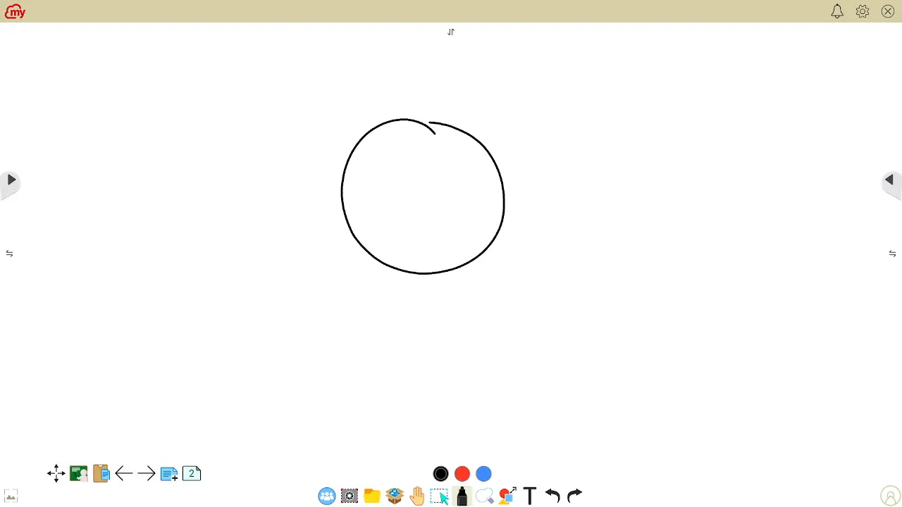
	

<!--Page deletion is achieved from the same menu that is used to change the pages. Upon pressing the icon that shows the number of pages (for example, `3`), the available pages are shown.

Each screen thumbnail has a red `X` in it's upper left corner. If you want to delete a particular one, press it's `X` symbol, and confirm your intent if a dialog pops up on the screen.-->

Stergerea paginilor se realizeaza din acelasi meniu care este utilizat pentru a schimba paginile. La apasarea pictogramei care afiseaza numarul de pagini (de exemplu, `3`), sunt afisate paginile disponibile.

Fiecare miniatura a ecranului are un `X` rosu in coltul sau din stanga sus. Daca doriti sa stergeti una anume, apasati simbolul `X` al acesteia si confirmati intentia daca apare un dialog pe ecran.

## Salvare ca PDF

	

		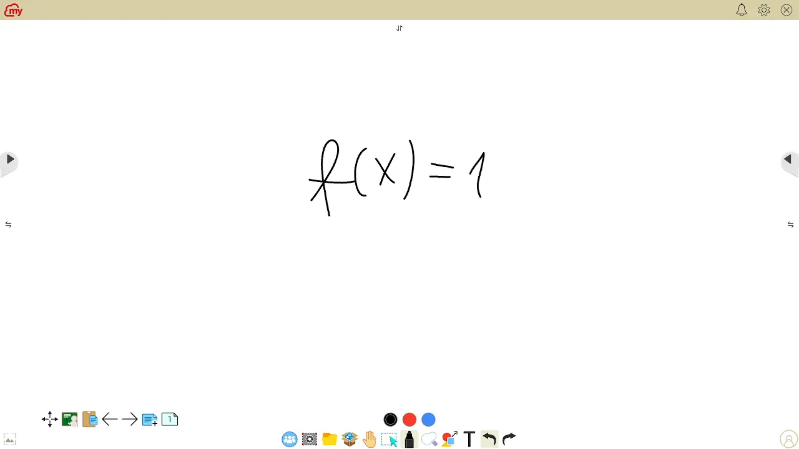
	

<!-- > **Attention:** Saving to a USB device might require formatting it with a FAT32 filesystem. Official tests were executed using a FAT32 device. If yours uses a different format, your mileage may vary.

It is possible to save all your boards on a `USB stick`, in a PDF format. In the resulting file, each page from the board corresponds to a page in the document.

Insert your USB device into one of the available slots on the front side of the board, in the bottom left corner. If it is successfuly recognized, a menu will show up mentioning `Device mounted`. From said menu, click `Cancel`, as it is a prompt to open the device for browsing it's file, and is unrelated to the intent of saving to it. 

Press on the `folder` icon from the bottom instrument panel. It is the third icon from the left. 

Choose the `export` tab of the newly opened menu. It is the second icon to the right. Once you're in the `export` tab, choose your `USB stick` as the device to save to, instead of the default, internal storage.

Below this selector, there is a text area for assigning a name to the file. If you press on this text field, a keyboard will show up, allowing you to enter a name. 

Make sure the type selector from the right of the text area is set on `PDF`, then press on the small tick icon available to the right of it. 

A new menu will show up prompting you to choose the actual folder where you want your file saved. It is most simple to simply click `Save` in the bottom right corner, and then organize your files later. -->

> **Atentie:** Salvarea pe un dispozitiv USB poate necesita formatarea acestuia cu un sistem de fisiere FAT32. Testele oficiale au fost efectuate utilizand un dispozitiv FAT32. Daca al dumneavoastra utilizeaza un format diferit, rezultatul poate varia.

Este posibil sa salvati toate desenele pe un `USB stick`, in format PDF. In fisierul rezultat, fiecare pagina din tabela corespunde unei pagini din document.

Introduceti dispozitivul USB in unul dintre sloturile disponibile pe partea din fata a ecranului, in coltul din stanga jos. Daca acesta este recunoscut cu succes, va aparea un meniu cu mentiunea `Device mounted` (Dispozitiv montat). Din meniul respectiv, faceti clic pe `Cancel` (Anulare), deoarece este o solicitare de a deschide dispozitivul pentru a parcurge fisierul acestuia si nu are legatura cu intentia de a salva pe acesta. 

Apasati pe pictograma `folder` din panoul de instrumente de jos. Este a treia pictograma din stanga. 

Alegeti fila `export` din meniul nou deschis. Este a doua pictograma din dreapta. Odata ce sunteti in fila `export`, alegeti `USB stick` ca dispozitiv de salvare, in loc de memoria interna implicita.

Sub acest selector, exista o zona de text pentru atribuirea unui nume fisierului. Daca apasati pe acest camp de text, va aparea o tastatura, permitandu-va sa introduceti un nume. 

Asigurati-va ca selectorul de tip din dreapta zonei de text este setat pe `PDF`, apoi apasati pe pictograma cu bifa mica disponibila in dreapta acesteia. 

Va aparea un nou meniu care va va cere sa alegeti folderul in care doriti sa salvati fisierul. Cel mai simplu este sa faceti pur si simplu clic pe `Save` in coltul din dreapta jos, iar apoi sa va organizati fisierele mai tarziu. 

## Revenire la meniu

	

		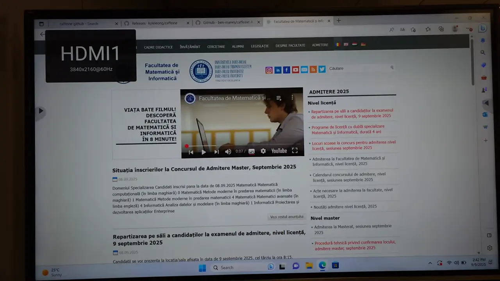
	

<!-- > You may also use the physical **home button** for this action

You may return to the main menu at any point by using the contextual menus available to the left and right of the board. They are depicted using two inner facing arrows, one of each side of the screen.

From the menu that opens, press the `home` icon.-->

> Puteti utiliza, de asemenea, **butonul home** fizic pentru aceasta actiune

Puteti reveni la meniul principal in orice moment prin utilizarea meniurilor contextuale disponibile in stanga si in dreapta tablei. Acestea sunt reprezentate cu ajutorul a doua sageti orientate spre interior, cate una de fiecare parte a ecranului.

Din meniul care se deschide, apasati pictograma `home`.
