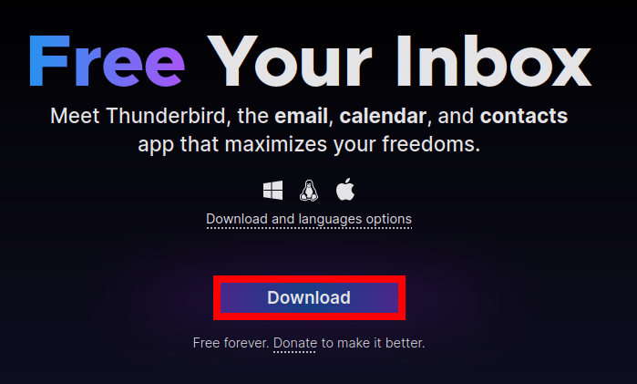
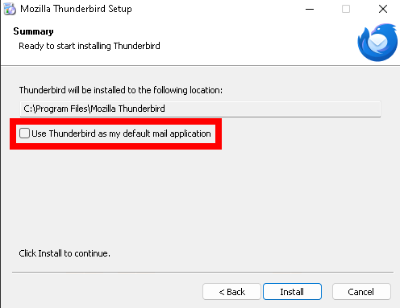
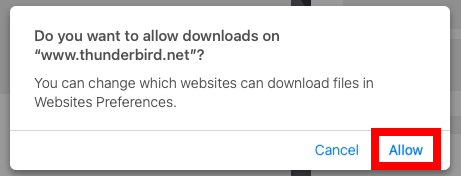
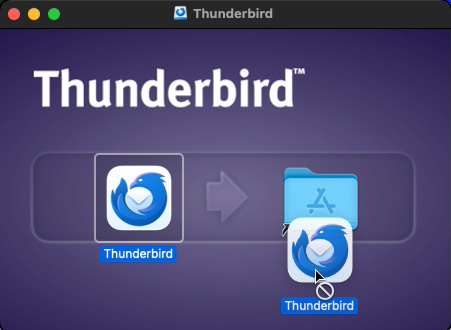
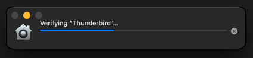
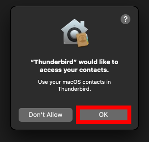

# Thunderbird - Instalare

Va rugam sa parcurgeti ghidul corespunzator sistemului dumneavoastra de operare, conform listei de mai jos:

- [Windows](#windows)
- [MacOS](#macos)
- [Linux](#linux)

## Windows

Accesati **[aceasta pagina](https://www.thunderbird.net/en-US/)** utilizand browserul dumneavoastra web preferat. Apoi, faceti clic pe butonul de descarcare.

	

		
	

La instalare, este acceptabil, de obicei, sa pastrati setarile implicite si sa continuati cu "Next" (Urmatorul) pana cand ajungeti la etapa "Install" (Instalare). Aici, este posibil sa doriti sa debifati optiunea "Use Thunderbird as my default mail application" **daca nu doriti sa utilizati Thunderbird ca aplicatie implicita de gestionare a e-mailurilor**.

	

		
	

Acum puteti face clic pe "Install" si asteptati finalizarea. 

Felicitari, Thunderbird este instalat!

## MacOS

Spre deosebire de majoritatea aplicatiilor, Thunderbird va trebui sa il descarcati de pe site-ul sau, care este accesibil **[aici](https://www.thunderbird.net/en-US/)**. Folositi browserul web preferat pentru a accesa pagina si apoi faceti clic pe butonul de descarcare, dupa cum este ilustrat mai jos. 

	

		
	

Cand intentionati sa incepeti descarcarea, este posibil sa apara un avertisment similar cu cel prezentat mai jos, ceea ce reprezinta un comportament normal. Daca se intampla acest lucru, faceti clic pe "Allow" (Permiteti).

	

		
	

Dupa finalizarea descarcarii, este posibil sa vi se afiseze urmatoarea fereastra. Pentru a continua, trebuie sa faceti clic si sa tineti apasata pictograma Thunderbird, apoi sa o trageti peste dosarul albastru, asa cum se arata in imaginea de mai jos. 

	

		
	

Il puteti porni acum. Va rugam sa retineti ca, la prima pornire, este posibil sa va confruntati cu urmatorul ecran de incarcare. Acest lucru este un comportament normal si trebuie pur si simplu sa asteptati. 

	

		
	

La sfarsitul verificarii, este posibil sa va confruntati in continuare cu avertismente, cum ar fi cel de mai jos. Acest lucru se intampla doar pentru ca aplicatia a fost proaspat instalata si va inceta sa mai apara in timp. In acest caz, faceti clic pe "OK" pentru a continua. 

	

		
	

Felicitari, Thunderbird este instalat!

## Linux

Utilizati managerul de pachete preferat pentru a instala Thunderbird. Pachetul se numeste de obicei `thunderbird`. 

Daca descarcati pachetul furnizat de site-ul web, il puteti extrage oriunde pe sistem si il puteti lansa in mod portabil. 

> Desi site-ul oficial ofera si versiuni compilate pentru Linux, cea mai buna practica este sa folositi distributia Thunderbird din sistemul dumneavoastra. **Nu recurgeti la solutii non-sistem decat daca sunteti sigur de ceea ce faceti**.

Daca utilizati fisierul oferit de site-ul web, structura dosarelor extrase poate arata astfel:

    $ tree -L 1    
    .
    ├── Throbber-small.gif
    ├── application.ini
    ├── chrome
    ├── crashreporter
    ├── crashreporter.ini
    ├── defaults
    ├── dependentlibs.list
    ├── fonts
    ├── glxtest
    ├── icons
    ├── isp
    .
    .
    .
    ├── removed-files
    ├── rnp-cli
    ├── rnpkeys
    ├── thunderbird
    ├── thunderbird-bin
    ├── update-settings.ini
    ├── updater
    ├── updater.ini
    └── vaapitest

In acest moment, puteti lansa executabilul `thunderbird` dupa cum urmeaza:

    $ ./thunderbird

Felicitari, Thunderbird este instalat!
