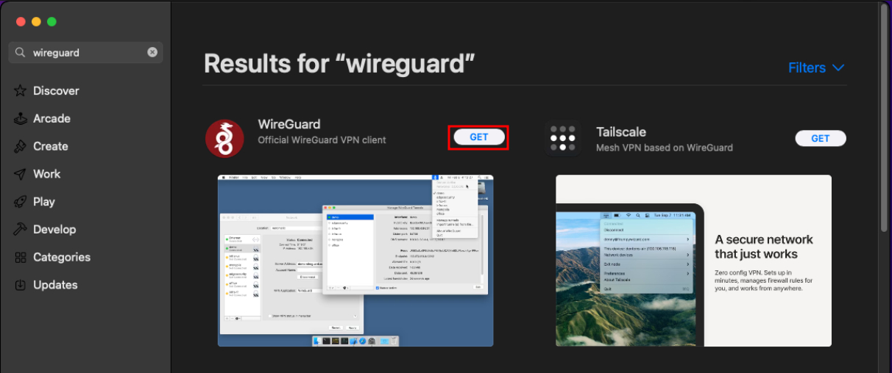
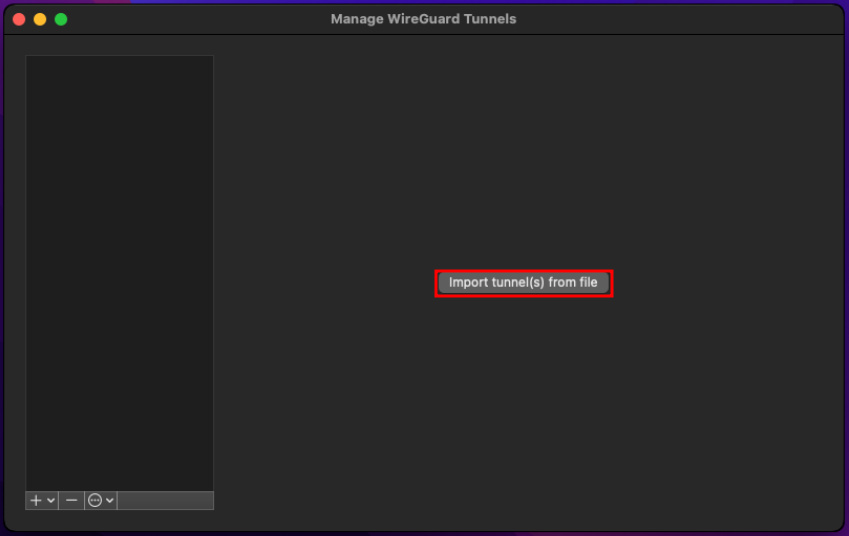
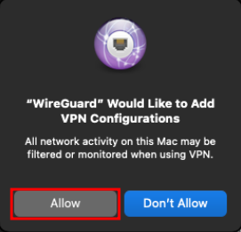
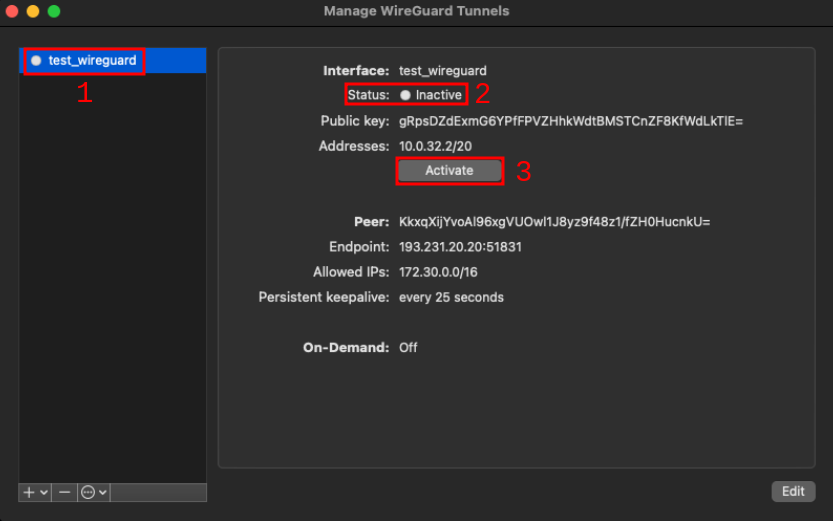
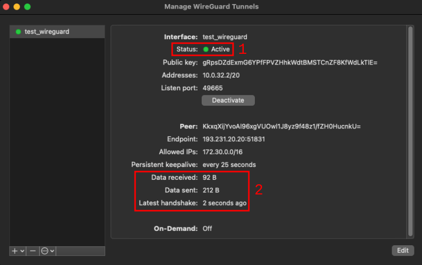
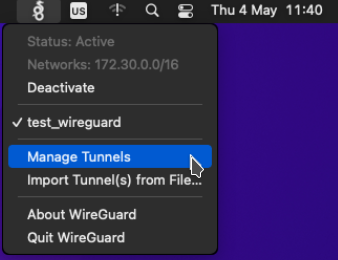

# MacOS

Accesati `App Store` de pe dispozitivul MacOS.

	

		
	

Cautati `Wireguard` si descarcati-l pe cel prezentat in imaginea de mai jos.

	

		
	

> Alternativ, puteti accesa [acest link](https://apps.apple.com/ro/app/wireguard/id1451685025?mt=12) pentru a ajunge direct la aplicatia corecta din App Store.

# Configurarea tunelului

	

		
	

Folositi butonul `Import tunnel(s) from file`, asa cum este indicat in imaginea de mai sus. Din fereastra de selectie, alegeti fisierul pe care l-ati descarcat in pasul anterior al ghidului, cel al carui nume se termina cu `.conf`.

	

		
	

Daca vi se solicita, permiteti ca Wireguard sa gestioneze conexiunile VPN existente, asa cum este indicat in imaginea de mai sus.

> Este posibil sa vi se ceara sa introduceti parola dispozitivului pentru a permite efectuarea acestei modificari.

	

		
	

Odata selectat, fereastra ar trebui sa se modifice dupa cum urmeaza:
1. **Numele tunelului VPN** - De multe ori se potriveste cu numele fisierului pe care tocmai l-ati selectat.
2. **Starea actuala a tunelului VPN** - Poate fi doar `Inactive` (Dezactivat) sau `Active` (Operational).
3. **Butonul pentru activarea/dezactivarea tunelului VPN** - Un singur buton, usor accesibil.

> Textul butoanelor si al statisticilor poate fi in alta limba. Cu toate acestea, pozitia lor ar trebui sa fie asemanatoare.

# Activarea conexiunii

	

		
	

Faceti clic pe campul `Activate` (Activare). Daca totul functioneaza corect, ar trebui sa se produca urmatoarele modificari:
1. **Status** - `Status` ar trebui sa fie acum `Active`, cu un semn verde in partea stanga.
2. **Latest handshake** - Ar fi trebuit sa se intample cu cel mult cateva secunde in urma.
3. **Data Received** - Numarul de `Bytes Received` ar trebui sa fie mai mare decat zero la un moment dat.

Pentru a dezactiva VPN-ul, faceti clic din nou pe butonul `Activate`, care acum ar trebui sa spuna `Deactivate`. 

> VPN-ul poate parea activ, dar totusi valoarea octetilor "primiti" ramane zero. In acest caz, va rugam sa verificati conectivitatea utilizand un hotspot mobil. Este foarte probabil ca configuratia actuala a retelei dvs. sa nu permita utilizarea VPN-ului. Daca functionalitatea prin hotspot-ul mobil este confirmata, va rugam sa consultati furnizorul dvs. de internet pentru asistenta suplimentara.

# Ascunderea ferestrei de configurare

	

		
	

Puteti inchide fereastra in orice moment. Daca conexiunea este activa, va ramane in continuare ruland in fundal. Puteti face ca fereastra sa apara din nou facand clic pe iconita Wireguard din partea din dreapta sus, ca in imaginea de mai sus.