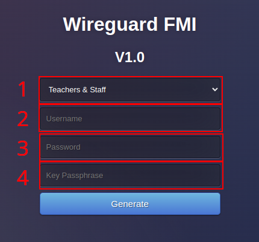

# VPN Wireguard

> Aceste instructiuni sunt menite sa ofere indicatii pentru configurarea noului VPN Wireguard.

In functie de tipul de cont (Profesor sau Student), este posibil sa obtineti permisiuni de retea diferite dupa cum urmeaza:

- Conturile cadrelor didactice sunt nelimitate si permit accesul complet la internet ca si cum ati fi fizic in campus
	- Aveti acces complet la echipamentele interne, la fel ca in reteaua locala
	- Site-urile pe care le vizitati cred ca va aflati fizic in campus, indiferent unde ati fi de fapt
	- Aveti acces la Web of Science si la alte site-uri de reviste, jurnale si articole
- Conturile studentilor sunt restrictionate si au acces doar la anumite echipamente interne
	- Studentii nu pot naviga pe internet prin VPN, chiar daca isi suprascriu configuratia VPN locala

> Viteza de acces la VPN este limitata din cauza constrangerilor legate de latimea de banda si de infrastructura.

In prezent, pentru a primi acces la VPN, trebuie sa solicitati permisiunea administratorilor de sistem. Ar fi recomandabil sa mentionati motivul pentru care aveti nevoie de acces.

Odata ce permisiunea a fost acordata, puteti accesa gateway-ul VPN prin intermediul unui **[browser web, la acest URL](https://www.cs.ubbcluj.ro/vpn)**.

	

		
	

