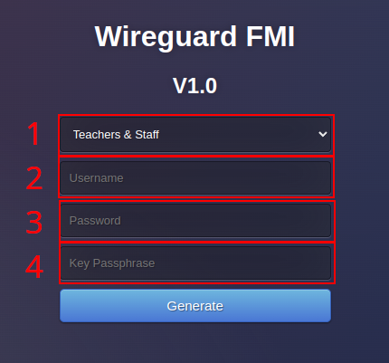

# VPN Wireguard

> Aceste instructiuni sunt menite sa ofere indicatii pentru configurarea noului VPN Wireguard.

In functie de tipul de cont (cadru didactic sau student), este posibil sa obtineti permisiuni de retea diferite dupa cum urmeaza:

- Conturile cadrelor didactice sunt nelimitate si permit accesul complet la internet ca si cum ati fi fizic in campus.
	- Aveti acces complet la echipamentele interne, la fel ca in reteaua locala.
	- Site-urile pe care le vizitati cred ca va aflati fizic in campus, indiferent unde ati fi de fapt.
	- Aveti acces la Web of Science si la alte site-uri de reviste, jurnale si articole.
- Conturile studentilor sunt restrictionate si au acces doar la anumite echipamente interne.
	- Studentii nu pot naviga pe internet prin VPN, chiar daca isi suprascriu configuratia VPN locala.

> Viteza de acces la VPN este limitata din cauza constrangerilor legate de latimea de banda si de infrastructura.

In prezent, pentru a primi acces la VPN, trebuie sa solicitati permisiunea administratorilor de sistem. Ar fi recomandabil sa mentionati motivul pentru care aveti nevoie de acces.

Odata ce permisiunea a fost acordata, puteti accesa gateway-ul VPN prin intermediul unui **[browser web, la acest URL](https://www.cs.ubbcluj.ro/vpn)**.

	

		
	

Aici aveti mai multe optiuni si campuri de completat. Ca atare, facand referire la captura de ecran de mai sus, acestea reprezinta:

1. **Tipul de acces la VPN** - Cadru didactic sau Student.
2. **Numele de utilizator de CS (sau SCS), fara adnotarea e-mail** - De exemplu, daca adresa de e-mail CS este test@cs.ubbcluj.ro, numele de utilizator este **test**.
3. **Parola contului dumneavoastra de CS (sau SCS)** - Aceeasi ca si parola webmail.
4. **O cheie unica pentru configuratia dumneavoastra** - Poate fi orice doriti, are rolul de a determina modul de generare a configuratiei dumneavoastra.

Dupa ce ati completat toate campurile, puteti face clic pe "Generate". Site-ul ar trebui sa va solicite sa descarcati un fisier al carui nume se termina cu ".conf". Pastrati acest fisier in siguranta.

> Fisierul de configurare joaca rolul unei carti de identitate. Oricine reuseste sa il fure poate sa se dea drept dumneavoastra. Intr-un astfel de scenariu, puteti fi tras la raspundere pentru eventualele consecinte.

Odata ce aveti fisierul la indemana, puteti trece la urmatorul pas din acest ghid, in functie de sistemul de operare pe care il utilizati. 

In cele din urma, puteti confirma functionalitatea VPN-ului asigurandu-va ca ISP-ul identificat [aici](https://www.whatismyisp.com/) este intr-adevar Universitatea Babes-Bolyai.

## Ghiduri specifice sistemului de operare

- Pentru **Windows**, ghidul este disponibil [aici](./windows/wireguard.md).
- Pentru **MacOS**, ghidul este disponibil [aici](./macos/wireguard.md).
- Pentru **Linux**, ghidul este disponibil [aici](./linux/wireguard.md).
