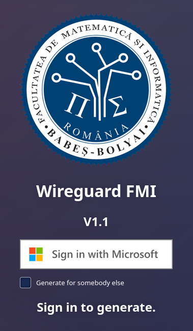

# VPN Wireguard

> Aceste instructiuni sunt menite sa ofere indicatii pentru configurarea noului VPN Wireguard.

In functie de tipul de cont (cadru didactic sau student), este posibil sa obtineti permisiuni de retea diferite dupa cum urmeaza:

- Conturile cadrelor didactice sunt nelimitate si permit accesul complet la internet ca si cum ati fi fizic in campus.
	- Aveti acces complet la echipamentele interne, la fel ca in reteaua locala.
	- Site-urile pe care le vizitati cred ca va aflati fizic in campus, indiferent unde ati fi de fapt.
	- Aveti acces la Web of Science si la alte site-uri de reviste, jurnale si articole.
- Conturile studentilor sunt restrictionate si au acces doar la anumite echipamente interne.
	- Studentii nu pot naviga pe internet prin VPN, chiar daca isi suprascriu configuratia VPN locala.

> Viteza de acces la VPN este limitata din cauza constrangerilor legate de latimea de banda si de infrastructura.

Orice student sau cadru didactic al facultatii noastre are acces la VPN prin autentificare folosind contul Microsoft. Adresa poate fi accesata **[aici](https://www.cs.ubbcluj.ro/vpn)**.

	

		
	

Daca sunteti cadru didactic, puteti genera un fisier de configurare si pentru altcineva. Va rugam **SA NU** generati configuratii pentru studenti, deoarece acestia trebuie sa parcurga singuri aceasta procedura.

Continuati cu autentificarea Microsoft pentru a genera fisierul de descarcat. Site-ul ar trebui sa va solicite sa descarcati un fisier al carui nume se termina cu ".conf". Pastrati acest fisier in siguranta.

> Fisierul de configurare joaca rolul unei carti de identitate. Oricine reuseste sa il fure poate sa se dea drept dumneavoastra. Intr-un astfel de scenariu, puteti fi tras la raspundere pentru eventualele consecinte.

Odata ce aveti fisierul la indemana, puteti trece la urmatorul pas din acest ghid, in functie de sistemul de operare pe care il utilizati. 

In cele din urma, puteti confirma functionalitatea VPN-ului asigurandu-va ca ISP-ul identificat [aici](https://www.whatismyisp.com/) este intr-adevar Universitatea Babes-Bolyai.

## Ghiduri specifice sistemului de operare

- Pentru **Windows**, ghidul este disponibil [aici](./windows/wireguard.md).
- Pentru **MacOS**, ghidul este disponibil [aici](./macos/wireguard.md).
- Pentru **Linux**, ghidul este disponibil [aici](./linux/wireguard.md).
